# 🧶 The Crochet Files

## 🏗️ User Experience

### **Project Overview**  
The Crochet Files is a web platform where users can share, explore, and engage with crochet projects.  

### **Goals & Challenges**  
- Create a user-friendly space for crochet enthusiasts.  
- Allow easy uploading and sharing of patterns.  
- Ensure a secure and engaging community.

### **Target Users**  
- Beginner to expert crocheters.  
- Users looking for inspiration and tutorials.  
- People who want to showcase their crochet work.

### **User Stories**  

#### **User Authentication & Profiles**  
- As a user, I want to create an account to access and contribute to crochet patterns.  
- As a user, I want to log in and out securely to protect my account.  
- As a user, I want to view crochet patterns shared by others so that I can find inspiration and ideas. 
- As a user, I want to like and comment on crochet patterns so that I can show appreciation and join the community.

#### **Project Uploads & Management**  
- As a user, I want to add a new crochet pattern with images and text so that I can share my work with others.  
- As a user, I want to edit my crochet pattern so that I can make corrections or updates.  
- As a user, I want to delete my crochet pattern so that I can remove content I no longer want to share.  
- As a user, I want to categorize my crochet patterns so that others can easily find them.

#### **Browsing & Filtering**  
- As a user, I want to browse crochet patterns so that I can find inspiration.  
- As a user, I want to filter crochet patterns by category and difficulty level so that I can find patterns that match my skill level.  
- As a user, I want to search for crochet patterns by keywords so that I can find specific patterns or techniques.

#### **Engagement & Interaction**  
- As a user, I want to like crochet patterns so that I can show appreciation for others' work.  
- As a user, I want to comment on crochet patterns so that I can ask questions and give feedback.  
- As a user, I want to delete my comments to remove anything I no longer want to say.  
- As a user, I want to see how many likes and comments a project has so that I can gauge its popularity.

#### **Admin & Moderation**  
- As an admin, I want to manage users so that I can ensure a positive community experience.  
- As an admin, I want to delete inappropriate projects or comments so that the platform remains safe and friendly.

## 📌 Site Structure  

### **Navigation Flow**  
How users move between different sections of the site.

### **User Flow Diagram**  

The User Flow Diagram maps out every step a user takes from arriving at the homepage to doing different tasks. 
such as exploring crochet projects, posting new posts, or interacting with content, giving a clear visual depiction of how visitors will move across the website. 
This diagram illustrates the steps users take to access important features, navigate between sites, and interact with forms. 
The User Flow Diagram guarantees that the website is easy to use, intuitive, and organised to offer a smooth experience by illustrating the user journey. 
It is a useful tool for enhancing usability, streamlining navigation, and spotting possible areas for improvement. 

Flow Diagram

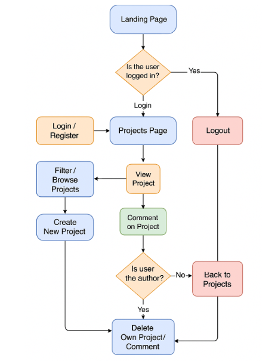

Wireframe Flow Diagram

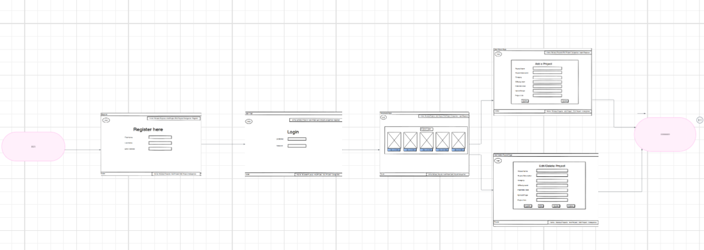

 

### **How Users Move Through the Site**  

- Home Page 
When visitors first arrive at the home page, they will be asked to either register or log in.

- Authentication

Users can either log in or register.

After logging in, they are redirected to the main Projects page.

- Browsing Patterns

Users can view all shared crochet patterns.

They can filter patterns by category or difficulty.

Clicking a pattern opens a detailed view with images, materials, notes, and pattern instructions.

- Engagement

Logged-in users can like or comment on patterns.

Users can also delete their comments.

- Creating Content

Logged-in users can create a new crochet pattern by filling out a form with all relevant fields.

After submission, the patterns are displayed in the Projects list.

- Logging Out

Users can safely log out using the navigation bar, which clears their session. 

## 📐 Wireframes

My website's wireframes serve as a basic framework for organising and arranging its overall design.
They ensure a well-organised layout that improves user experience by offering clear visual guidance for creating each page.
The wireframes outline important components like navigation, content placement, and interactive features.
which helps to expedite the design process and guarantee a logical, user-friendly flow throughout the website.

#### Desktop Wireframe 

Login Page - Desktop

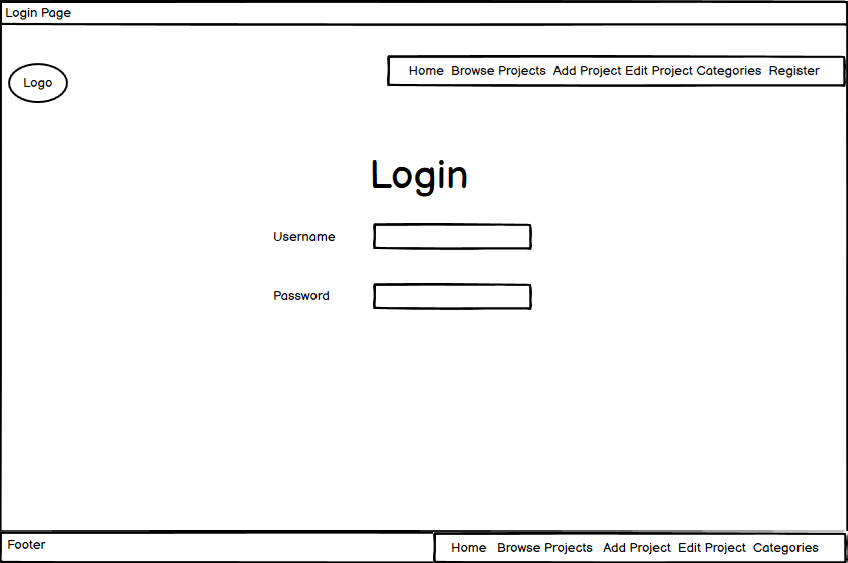

Resgistration Page - Desktop

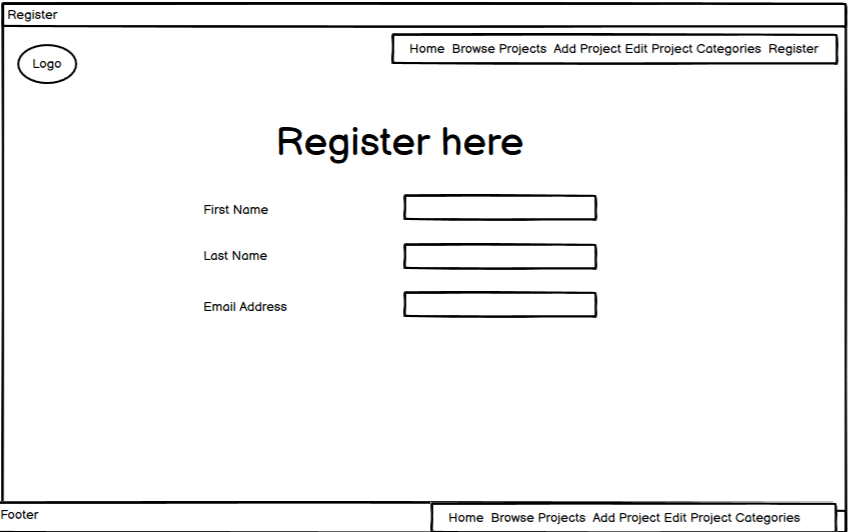

Home Page - Desktop

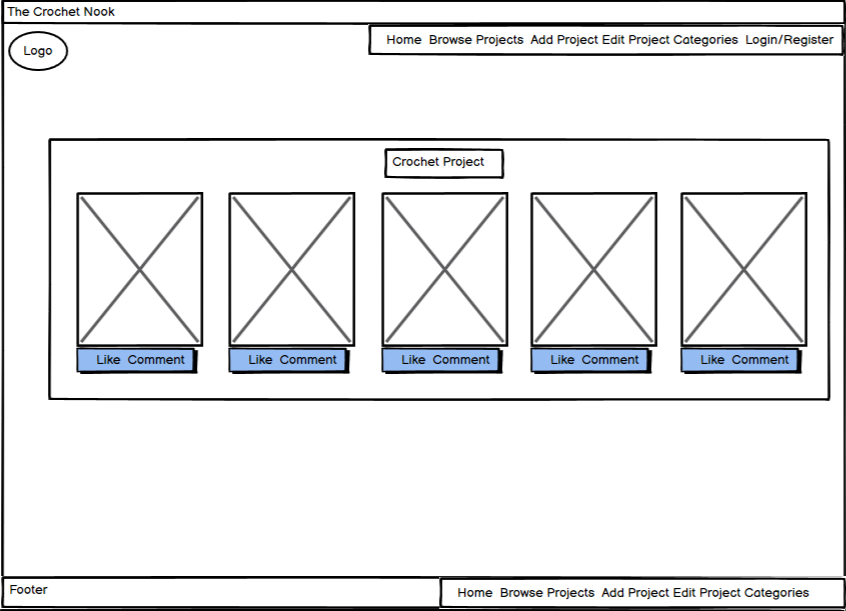

Project Page - Desktop

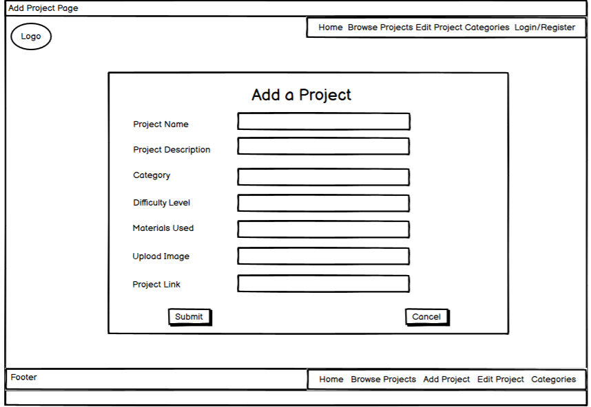

Edit Page - Desktop

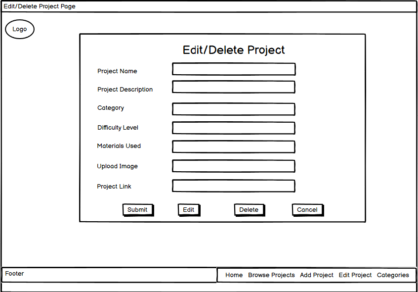

#### Mobile Wireframe 

Login Page - Mobile

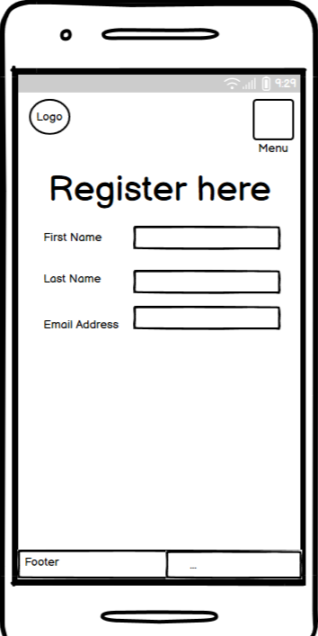

Resgistration Page - Mobile

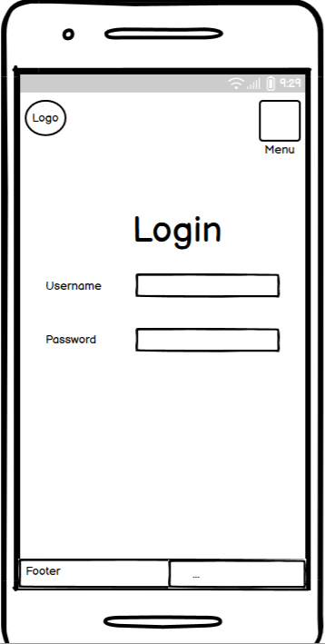

Home Page - Mobile

Project Page - Mobile

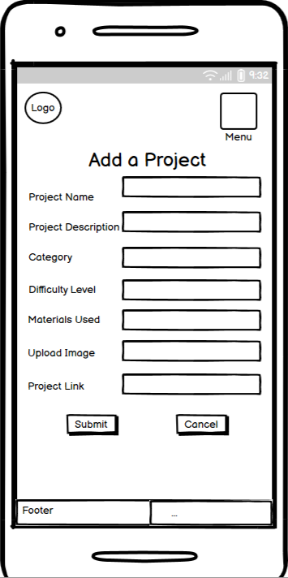

Edit Page - Mobile

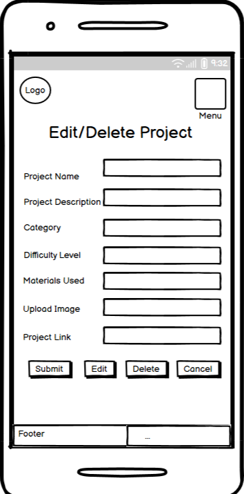

#### Tablet and iPad Wireframe 

Login Page - Desktop

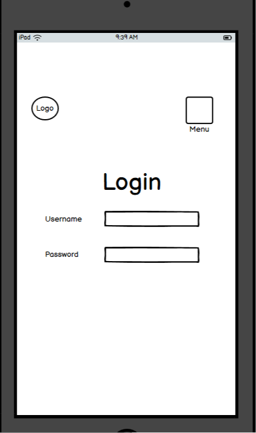

Resgistration Page - Desktop

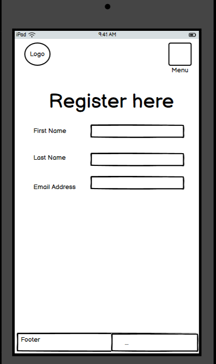

Home Page - Desktop

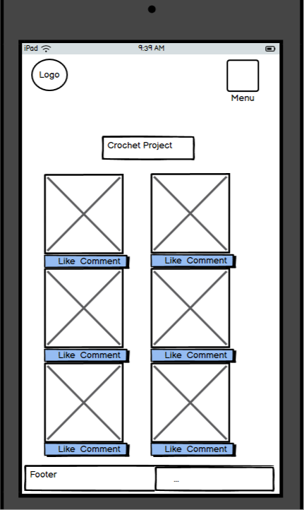

Project Page - Desktop

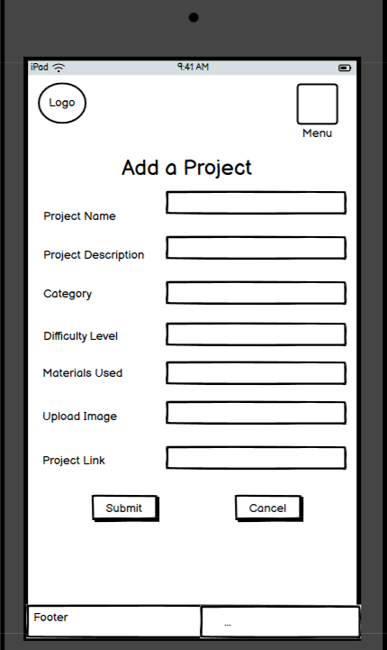

Edit Page - Desktop

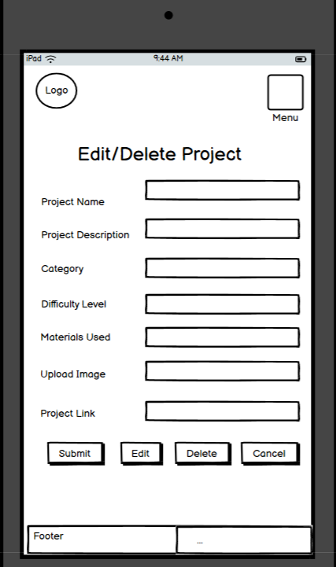

## 🎨 Design & Branding  

### **Logo**

The logo features the text "The Crochet Files" written in a stylish, handwritten script font that gives off a cozy and personal feel. The text is in black against a light blue background, enhancing readability while maintaining a soft, welcoming aesthetic. The playful and artistic style of the font conveys a sense of creativity, fitting well with the handmade, crafty vibe typically associated with crochet.

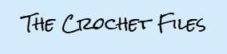

### **Colour Scheme**  

The Crochet Files features a soft and inviting color palette that reflects the cozy, handcrafted essence of crochet. The site’s background uses a calming pastel blue (#C3E4F8), creating a gentle and welcoming atmosphere.

Content is organized using clean white cards (#FFFFFF) for clarity and contrast. Project cards are enhanced with a delicate pale pink dotted border (#FCDDE8), adding a subtle touch of charm and warmth that complements the overall pastel theme.

Each project card includes three pastel-colored buttons designed for clarity and accessibility:

- View Patterns: A light blue button that invites users to explore more.

- Edit: A soft yellow button that adds a cheerful, approachable tone for updates.

- Delete: A gentle pink button that maintains visual harmony while signaling caution.

This carefully curated palette ensures a cohesive, soothing, and user-friendly experience, aligning perfectly with the comforting and creative spirit of the crochet community. 

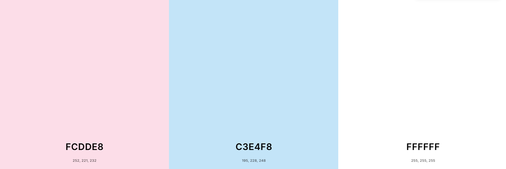

### **Typography** 

The Crochet Files uses a combination of two fonts — Rock Salt and Quicksand — to reflect both personality and readability throughout the site.

Rock Salt:
This playful, hand-drawn font brings a handcrafted, whimsical vibe to the site. Inspired by real handwriting with a slightly rough texture, it's perfect for headings or branding elements that need a personal, artsy touch, fitting the handmade spirit of crochet.

Quicksand:
A clean, rounded sans-serif font that’s modern, friendly, and easy to read. Quicksand is used for body text and content areas, providing excellent readability while maintaining a soft and approachable look that complements the cozy aesthetic of the platform.

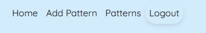

Together, these fonts strike a balance between charm and clarity — one expressive and craft-inspired, the other smooth and practical — enhancing the overall user experience with both style and substance.

### **Layout**

The page layout for The Crochet Files is warm, welcoming, and neatly organized, featuring a grid-style interface with visually appealing images. Here’s a breakdown of the layout:

Header Section
- Text: "Welcome to The Crochet Files"
- Large, bold, and centered at the top.
- Subtext: "Select a category to explore:"
- Smaller, friendly instructions just below the main heading.

Main Content – Category Grid
- The content is displayed in a 3-column grid layout, with two rows.
- Each category is shown inside a rounded rectangle box with:
- A high-quality image of the crochet item.
- The name of the category is centered beneath the image in a clean, sans-serif font.

### **Images & Visuals**  

#### **Registration Page**

Welcome to the registration page for The Crochet Files! Here, new users can create a personal account to start sharing their crochet patterns, explore others’ work, and connect with a creative community.

The registration form includes fields for a username, a secure password, and password confirmation. Helpful password guidelines are listed to ensure your account stays safe.

At the top, the navigation bar allows quick access to key areas of the site:

Home, Add Patterns, Patterns, Login and Register

The page design keeps a soft, welcoming tone with a light blue background, easy-to-read fonts, and a simple, user-friendly layout—just like a cozy crochet files!

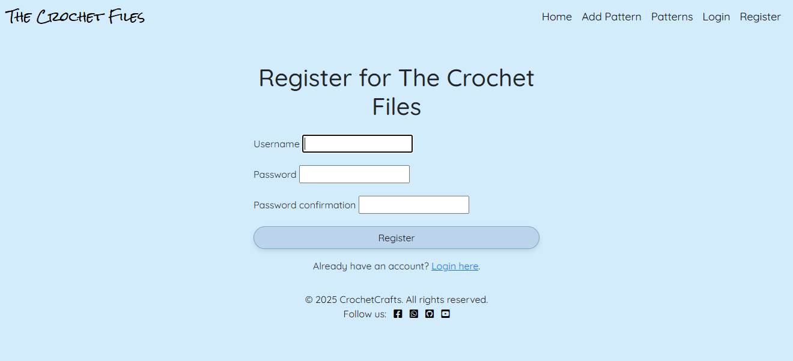

#### **Login Page**

The login page for The Crochet Files allows returning users to securely sign in to their account. With a simple form layout, users can enter their username and password to access their crochet patterns, add new creations, or interact with the crafting community.

Helpful navigation links are available in the top right corner, making it easy to:

- Home page

- Browse Crochet Pattern

- Add a New Pattern

- Register a new account

The gentle blue background and clean design make for a peaceful, user-friendly login experience, perfectly matching the warm, handmade vibe of the crochet world.

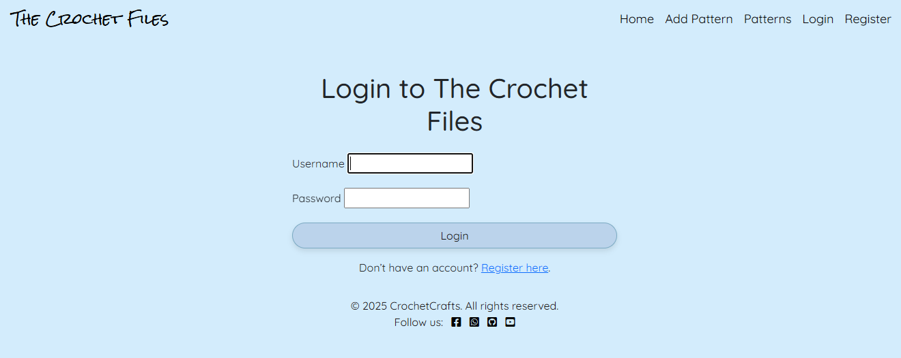

#### **Home Page**

The Welcome Page of The Crochet Files invites users into a cozy, colorful space to explore different crochet project categories. The layout features a friendly greeting at the top, followed by a prompt to select a category.

Displayed in a 2-row, 3-column grid, each category is represented with:

A vibrant, high-quality photo of a crocheted item

A label beneath each image's name indicates the category

Categories include:

- Blankets – Warm, textured throws for cozy vibes

- Cardigans – Stylish, handmade wearables

- Amigurumi – Adorable stuffed animals and characters

- Scarves – Colorful, snug accessories

- Hats – Beanies and pom-pom-topped headwear

- Dishcloths – Functional and decorative essentials

The entire layout sits on a soft blue background, reflecting the calm and creative spirit of the crochet community. Each card is spaced evenly and bordered in white, making navigation both intuitive and visually inviting.

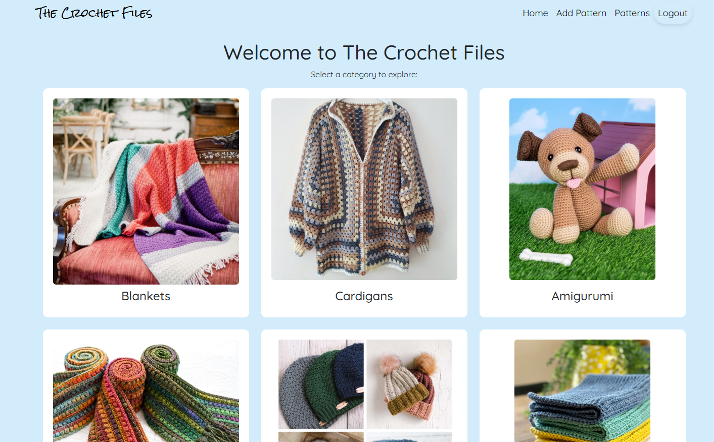

#### **Add Pattern Page**

The “Add a New Pattern” page on The Crochet Files allows users to share their crochet creations by submitting detailed pattern entries. The page features a clean form layout with labeled fields for user input.

Form Fields Include:

Pattern Name – A single-line text field to title the pattern.

Description – A larger text area for an overview or story behind the pattern.

Skill Level – A dropdown menu to select difficulty (e.g., Beginner).

Materials Needed – A field to list yarn types, hook sizes, and other supplies.

Category – Dropdown to categorize the pattern (e.g., Blanket, Hat, Amigurumi).

Notes – Optional space for tips, modifications, or personal thoughts.

File Uploads:

Upload Pattern (PDF) – Attach a pattern file to share with others.

Upload Image – Upload a photo of the finished project for inspiration.

At the bottom, a rounded “Save Project” button allows users to submit their pattern once complete.

The page uses a soft blue background with a simple, welcoming aesthetic, keeping the focus on creativity and contribution.

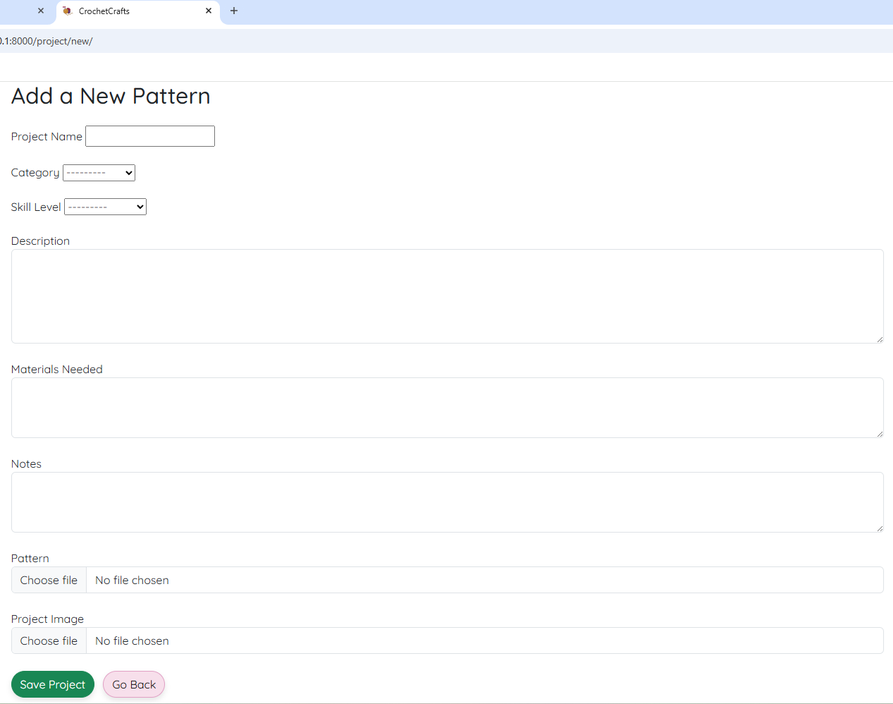

#### **Pattern Page**

The Crochet Files page is a beautifully laid-out collection of user-added crochet patterns. It serves as a gallery where each pattern is presented with a preview, allowing users to browse, view, edit, or delete their creations.

Page Layout & Features:

Add New Pattern Button:

Located at the top, this button allows users to quickly navigate to the form for submitting a new crochet pattern.

Pattern Cards:

Each pattern is displayed within an individual, color-bordered card.

Image Preview: A photo representing the crochet project.

Pattern Title: Clearly stated at the top of the card.

Short Description: A summary of the pattern’s charm and purpose (truncated for quick browsing).

Skill Level: Shows the required experience: Beginner, Intermediate, and Advanced.

Category: Organizes the pattern type: Blankets, Cardigans, Amigurumi, Hats, Scarves, and Dishcloths.

Action Buttons:

View Pattern: Takes the user to the full pattern description and downloadable resources.

Edit: Allows the user to update any pattern details.

Delete: Removes the pattern from the list.

Design: Uses soft pastel colors and a dotted border for each card to give a handcrafted, friendly vibe.

Clear layout promotes easy navigation and interaction with each pattern.

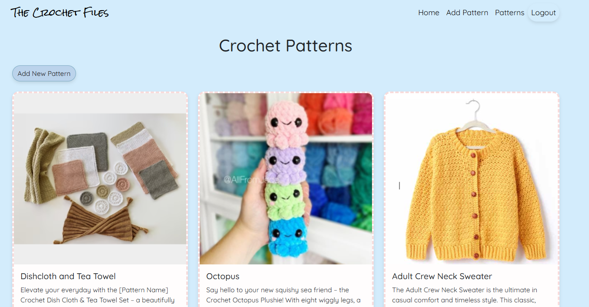

#### **Blanket Project Page** 

This page is a "Blanket Patterns" section from a crochet-themed website, likely part of The Crochet Files or My Crochet Page. It displays six crochet blanket pattern cards in a visually appealing grid layout, using a soft, pastel color palette with a light blue background. Each card includes:

Pattern Name: Bunny Blanket, Baby Blanket, and more.

Image of the blanket

Brief Description of the pattern

A "View Pattern" button styled with a blue border and hover effect

The six featured blanket patterns are:

Bunny Blanket – A cozy blanket with an adorable bunny theme.

Baby Blanket – A simple, soothing baby blanket ideal for beginners.

Granny Square Blanket – A vibrant, colorful take on a traditional granny square design.

Lattice Blanket – Elegant with a textured design, great for home decor.

Shell Blanket – Features pastel shell stitch patterns, soft and elegant.

Cat and Mouse Blanket – Whimsical and fun, featuring cat and mouse motifs.

Each pattern is likely clickable for more details. The layout and card style are consistent and user-friendly, making it easy to browse.

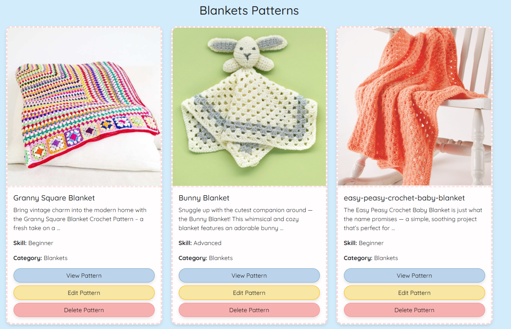

