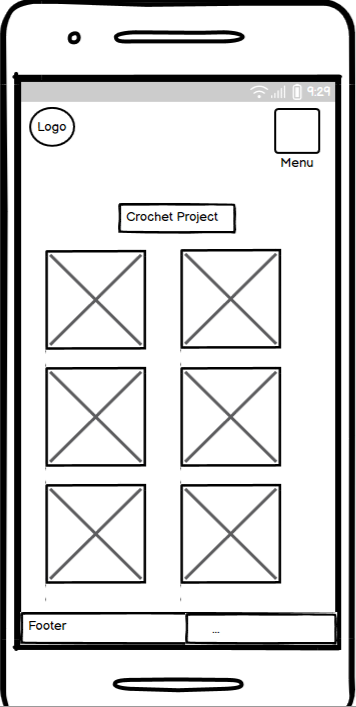

# 🧶 The Crochet Files

## 🏗️ User Experience

### **Project Overview**  
The Crochet Files is a web platform where users can share, explore, and engage with crochet projects.  

### **Goals & Challenges**  
- Create a user-friendly space for crochet enthusiasts.  
- Allow easy uploading and sharing of projects.  
- Ensure a secure and engaging community.

### **Target Users**  
- Beginner to expert crocheters.  
- Users looking for inspiration and tutorials.  
- People who want to showcase their crochet work.

### **User Stories**  

#### **User Authentication & Profiles**  
- As a user, I want to create an account to access and contribute to crochet projects.  
- As a user, I want to log in and out securely to protect my account.  
- As a user, I want to view crochet projects shared by others so that I can find inspiration and ideas. 
- As a user, I want to like and comment on crochet projects so that I can show appreciation and join the community.

#### **Project Uploads & Management**  
- As a user, I want to add a new crochet project with images and text so that I can share my work with others.  
- As a user, I want to edit my crochet projects so that I can make corrections or updates.  
- As a user, I want to delete my crochet projects so that I can remove content I no longer want to share.  
- As a user, I want to categorize my crochet projects so that others can easily find them.

#### **Browsing & Filtering**  
- As a user, I want to browse crochet projects so that I can find inspiration.  
- As a user, I want to filter crochet projects by category and difficulty level so that I can find patterns that match my skill level.  
- As a user, I want to search for crochet projects by keywords so that I can find specific patterns or techniques.

#### **Engagement & Interaction**  
- As a user, I want to like crochet projects so that I can show appreciation for others' work.  
- As a user, I want to comment on crochet projects so that I can ask questions and give feedback.  
- As a user, I want to delete my comments to remove anything I no longer want to say.  
- As a user, I want to see how many likes and comments a project has so that I can gauge its popularity.

#### **Admin & Moderation**  
- As an admin, I want to manage users so that I can ensure a positive community experience.  
- As an admin, I want to delete inappropriate projects or comments so that the platform remains safe and friendly.

## 📌 Site Structure  

### **Navigation Flow**  
How users move between different sections of the site.

### **User Flow Diagram**  

The User Flow Diagram maps out every step a user takes from arriving at the homepage to doing different tasks. 
such as exploring crochet projects, posting new posts, or interacting with content, giving a clear visual depiction of how visitors will move across the website. 
This diagram illustrates the steps users take to access important features, navigate between sites, and interact with forms. 
The User Flow Diagram guarantees that the website is easy to use, intuitive, and organised to offer a smooth experience by illustrating the user journey. 
It is a useful tool for enhancing usability, streamlining navigation, and spotting possible areas for improvement. 

Flow Diagram

Wireframe Flow Diagram

 

### **How Users Move Through the Site**  

- Home Page 
When visitors first arrive at the home page, they will be asked to either register or log in.

- Authentication

Users can either log in or register.

After logging in, they are redirected to the main Projects page.

- Browsing Projects

Users can view all shared crochet projects.

They can filter projects by category or difficulty.

Clicking a project opens a detailed view with images, materials, notes, and pattern instructions.

- Engagement

Logged-in users can like or comment on projects.

Users can also delete their comments.

- Creating Content

Logged-in users can create a new crochet project by filling out a form with all relevant fields.

After submission, the project is displayed in the Projects list.

- Logging Out

Users can safely log out using the navigation bar, which clears their session. 

## 📐 Wireframes

My website's wireframes serve as a basic framework for organising and arranging its overall design.
They ensure a well-organised layout that improves user experience by offering clear visual guidance for creating each page.
The wireframes outline important components like navigation, content placement, and interactive features.
which helps to expedite the design process and guarantee a logical, user-friendly flow throughout the website.

#### Desktop Wireframe 

Login Page - Desktop

Resgistration Page - Desktop

Home Page - Desktop

Project Page - Desktop

Edit Page - Desktop

#### Mobile Wireframe 

Login Page - Mobile

Resgistration Page - Mobile

Home Page - Mobile

Project Page - Mobile

Edit Page - Mobile

#### Tablet and iPad Wireframe 

Login Page - Desktop

Resgistration Page - Desktop

Home Page - Desktop

Project Page - Desktop

Edit Page - Desktop

## 🎨 Design & Branding  

### **Logo**

The logo features the text "The Crochet Nook" written in a stylish, handwritten script font that gives off a cozy and personal feel. The text is in black against a light blue background, enhancing readability while maintaining a soft, welcoming aesthetic. The playful and artistic style of the font conveys a sense of creativity, fitting well with the handmade, crafty vibe typically associated with crochet.

### **Colour Scheme**  

The Crochet Nook features a soft and inviting color palette that reflects the cozy, handcrafted essence of crochet. The site’s background uses a calming pastel blue (#C3E4F8), creating a gentle and welcoming atmosphere.

Content is organized using clean white cards (#FFFFFF) for clarity and contrast. Project cards are enhanced with a delicate pale pink dotted border (#FCDDE8), adding a subtle touch of charm and warmth that complements the overall pastel theme.

Each project card includes three pastel-colored buttons designed for clarity and accessibility:

- View Project: A light blue button that invites users to explore more.

- Edit: A soft yellow button that adds a cheerful, approachable tone for updates.

- Delete: A gentle pink button that maintains visual harmony while signaling caution.

This carefully curated palette ensures a cohesive, soothing, and user-friendly experience, aligning perfectly with the comforting and creative spirit of the crochet community. 

### **Typography** 

The Crochet Nook uses a combination of two fonts — Rock Salt and Quicksand — to reflect both personality and readability throughout the site.

Rock Salt:
This playful, hand-drawn font brings a handcrafted, whimsical vibe to the site. Inspired by real handwriting with a slightly rough texture, it's perfect for headings or branding elements that need a personal, artsy touch, fitting the handmade spirit of crochet.

Quicksand:
A clean, rounded sans-serif font that’s modern, friendly, and easy to read. Quicksand is used for body text and content areas, providing excellent readability while maintaining a soft and approachable look that complements the cozy aesthetic of the platform.

Together, these fonts strike a balance between charm and clarity — one expressive and craft-inspired, the other smooth and practical — enhancing the overall user experience with both style and substance.

### **Layout**

The page layout for The Crochet Nook is warm, welcoming, and neatly organized, featuring a grid-style interface with visually appealing images. Here’s a breakdown of the layout:

Header Section
- Text: "Welcome to The Crochet Nook"
- Large, bold, and centered at the top.
- Subtext: "Select a category to explore:"
- Smaller, friendly instructions just below the main heading.

Main Content – Category Grid
- The content is displayed in a 3-column grid layout, with two rows.
- Each category is shown inside a rounded rectangle box with:
- A high-quality image of the crochet item.
- The name of the category centered beneath the image in a clean, sans-serif font.

