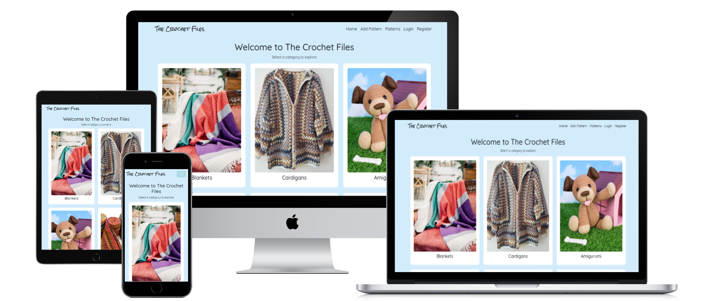

# 🧶 The Crochet Files

[View the live project here.](https://crochet-files-84195481b131.herokuapp.com/)

## 🏗️ User Experience

### **Project Overview**  
The Crochet Files is a web platform where users can share, explore, and engage with crochet projects.  
*Crochet Files is a full-stack Django application designed for scalability, with ongoing feature development to enhance user engagement and platform functionality.*

### **Goals & Challenges**  
- Create a user-friendly space for crochet enthusiasts.  
- Allow easy uploading and sharing of patterns.  
- Ensure a secure and engaging community.

### **Target Users**  
- Beginner to expert crocheters.  
- Users looking for inspiration and tutorials.  
- People who want to showcase their crochet work.

### **User Stories**  

#### **User Authentication & Profiles**  
- As a user, I want to create an account to access and contribute to crochet patterns.  
- As a user, I want to log in and out securely to protect my account.  
- As a user, I want to view crochet patterns shared by others so that I can find inspiration and ideas. 
- As a user, I want to like and comment on crochet patterns so that I can show appreciation and join the community.

#### **Project Uploads & Management**  
- As a user, I want to add a new crochet pattern with images and text so that I can share my work with others.  
- As a user, I want to edit my crochet pattern so that I can make corrections or updates.  
- As a user, I want to delete my crochet pattern so that I can remove content I no longer want to share.  
- As a user, I want to categorize my crochet patterns so that others can easily find them.

#### **Browsing & Filtering**  
- As a user, I want to browse crochet patterns so that I can find inspiration.  
- As a user, I want to filter crochet patterns by category and difficulty level so that I can find patterns that match my skill level.  
- As a user, I want to search for crochet patterns by keywords so that I can find specific patterns or techniques.

#### **Engagement & Interaction**  
- As a user, I want to like crochet patterns so that I can show appreciation for others' work.  
- As a user, I want to comment on crochet patterns so that I can ask questions and give feedback.  
- As a user, I want to delete my comments to remove anything I no longer want to say.  
- As a user, I want to see how many likes and comments a project has so that I can gauge its popularity.

#### **Admin & Moderation**  
- As an admin, I want to manage users so that I can ensure a positive community experience.  
- As an admin, I want to delete inappropriate projects or comments so that the platform remains safe and friendly.

## 📌 Site Structure  

### **Navigation Flow**  
How users move between different sections of the site.

### **User Flow Diagram**  

The User Flow Diagram maps out every step a user takes from arriving at the homepage to doing different tasks. 
such as exploring crochet projects, posting new posts, or interacting with content, giving a clear visual depiction of how visitors will move across the website. 
This diagram illustrates the steps users take to access important features, navigate between sites, and interact with forms. 
The User Flow Diagram guarantees that the website is easy to use, intuitive, and organised to offer a smooth experience by illustrating the user journey. 
It is a useful tool for enhancing usability, streamlining navigation, and spotting possible areas for improvement. 

Flow Diagram

Wireframe Flow Diagram

 

ERD

 

### **How Users Move Through the Site**  

- Home Page 
When visitors first arrive at the home page, they will be asked to either register or log in.

- Authentication

Users can either log in or register.

After logging in, they are redirected to the main Projects page.

- Browsing Patterns

Users can view all shared crochet patterns.

They can filter patterns by category or difficulty.

Clicking a pattern opens a detailed view with images, materials, notes, and pattern instructions.

- Engagement

Logged-in users can like or comment on patterns.

Users can also delete their comments.

- Creating Content

Logged-in users can create a new crochet pattern by filling out a form with all relevant fields.

After submission, the patterns are displayed in the Projects list.

- Logging Out

Users can safely log out using the navigation bar, which clears their session. 

## 📐 Wireframes

My website's wireframes serve as a basic framework for organising and arranging its overall design.
They ensure a well-organised layout that improves user experience by offering clear visual guidance for creating each page.
The wireframes outline important components like navigation, content placement, and interactive features.
which helps to expedite the design process and guarantee a logical, user-friendly flow throughout the website.

#### Desktop Wireframe 

Login Page - Desktop

Resgistration Page - Desktop

Home Page - Desktop

Project Page - Desktop

Edit Page - Desktop

#### Mobile Wireframe 

Login Page - Mobile

Resgistration Page - Mobile

Home Page - Mobile

Project Page - Mobile

Edit Page - Mobile

#### Tablet and iPad Wireframe 

Login Page - Desktop

Resgistration Page - Desktop

Home Page - Desktop

Project Page - Desktop

Edit Page - Desktop

## 🎨 Design & Branding  

### **Logo**

The logo features the text "The Crochet Files" written in a stylish, handwritten script font that gives off a cozy and personal feel. The text is in black against a light blue background, enhancing readability while maintaining a soft, welcoming aesthetic. The playful and artistic style of the font conveys a sense of creativity, fitting well with the handmade, crafty vibe typically associated with crochet.

### **Colour Scheme**  

The Crochet Files features a soft and inviting color palette that reflects the cozy, handcrafted essence of crochet. The site’s background uses a calming pastel blue (#C3E4F8), creating a gentle and welcoming atmosphere.

Content is organized using clean white cards (#FFFFFF) for clarity and contrast. Project cards are enhanced with a delicate pale pink dotted border (#FCDDE8), adding a subtle touch of charm and warmth that complements the overall pastel theme.

Each project card includes three pastel-colored buttons designed for clarity and accessibility:

- View Patterns: A light blue button that invites users to explore more.

- Edit: A soft yellow button that adds a cheerful, approachable tone for updates.

- Delete: A gentle pink button that maintains visual harmony while signaling caution.

This carefully curated palette ensures a cohesive, soothing, and user-friendly experience, aligning perfectly with the comforting and creative spirit of the crochet community. 

### **Typography** 

The Crochet Files uses a combination of two fonts — Rock Salt and Quicksand — to reflect both personality and readability throughout the site.

Rock Salt:
This playful, hand-drawn font brings a handcrafted, whimsical vibe to the site. Inspired by real handwriting with a slightly rough texture, it's perfect for headings or branding elements that need a personal, artsy touch, fitting the handmade spirit of crochet.

Quicksand:
A clean, rounded sans-serif font that’s modern, friendly, and easy to read. Quicksand is used for body text and content areas, providing excellent readability while maintaining a soft and approachable look that complements the cozy aesthetic of the platform.

Together, these fonts strike a balance between charm and clarity — one expressive and craft-inspired, the other smooth and practical — enhancing the overall user experience with both style and substance.

### **Layout**

The page layout for The Crochet Files is warm, welcoming, and neatly organized, featuring a grid-style interface with visually appealing images. Here’s a breakdown of the layout:

Header Section
- Text: "Welcome to The Crochet Files"
- Large, bold, and centered at the top.
- Subtext: "Select a category to explore:"
- Smaller, friendly instructions just below the main heading.

Main Content – Category Grid
- The content is displayed in a 3-column grid layout, with two rows.
- Each category is shown inside a rounded rectangle box with:
- A high-quality image of the crochet item.
- The name of the category is centered beneath the image in a clean, sans-serif font.

### **Images & Visuals**  

#### **Registration Page**

Welcome to the registration page for The Crochet Files! Here, new users can create a personal account to start sharing their crochet patterns, explore others’ work, and connect with a creative community.

The registration form includes fields for a username, a secure password, and password confirmation. Helpful password guidelines are listed to ensure your account stays safe.

At the top, the navigation bar allows quick access to key areas of the site:

Home, Add Patterns, Patterns, Login and Register

The page design keeps a soft, welcoming tone with a light blue background, easy-to-read fonts, and a simple, user-friendly layout—just like a cozy crochet files!

#### **Login Page**

The login page for The Crochet Files allows returning users to securely sign in to their account. With a simple form layout, users can enter their username and password to access their crochet patterns, add new creations, or interact with the crafting community.

Helpful navigation links are available in the top right corner, making it easy to:

- Home page

- Browse Crochet Pattern

- Add a New Pattern

- Register a new account

The gentle blue background and clean design make for a peaceful, user-friendly login experience, perfectly matching the warm, handmade vibe of the crochet world.

#### **Navagation Bar**

##### **Navigation Bar Before Registration**

For users who have not logged in yet, the navbar presents options to either log in or create a new account. It includes:

Logo or Site Title on the left, linking back to the homepage.

##### Core navigation links:

Home – Directs users to the homepage to explore patterns and other content.

Add Pattern – Visible only to logged-in users, so this might not be shown on the logged-out navbar.

Patterns – A page featuring all available crochet patterns from the community.

##### On the right-hand side:

Login – A button that takes users to the login page where they can access their account.

Register – A button that leads to the registration page, where new users can sign up for an account.

##### Design Highlights:

Same pastel blue background with white text links for a cohesive and welcoming feel.

Clean and minimal, designed to invite users to join or access their account.

Collapsible on mobile with a hamburger menu, keeping navigation fluid across devices.

 

##### **Navigation Bar After Registration**

Once a user has successfully logged in, the navbar adapts to provide easy access to their personalized features. It includes:

Logo or Site Title on the left, linking back to the homepage.

##### Core navigation links:

Home – Directs to the homepage, featuring a welcoming layout of patterns and content.

Add Pattern – Allows users to add their own crochet patterns to share with the community.

Patterns – Leads to a collection of all user-submitted crochet patterns.

##### On the right-hand side:

Logout – A button to log the user out of their account, styled with a soft blue background and clear text.

##### Design Highlights:

Soft pastel blue background for the navbar with white text links.

A streamlined layout with easy-to-access buttons, making navigation smooth for logged-in users.

Responsive design that collapses into a hamburger menu on smaller screens, ensuring it works well on mobile.

#### **Home Page**

The Welcome Page of The Crochet Files invites users into a cozy, colorful space to explore different crochet project categories. The layout features a friendly greeting at the top, followed by a prompt to select a category.

Displayed in a 2-row, 3-column grid, each category is represented with:

A vibrant, high-quality photo of a crocheted item

A label beneath each image's name indicates the category

Categories include:

- Blankets – Warm, textured throws for cozy vibes

- Cardigans – Stylish, handmade wearables

- Amigurumi – Adorable stuffed animals and characters

- Scarves – Colorful, snug accessories

- Hats – Beanies and pom-pom-topped headwear

- Dishcloths – Functional and decorative essentials

The entire layout sits on a soft blue background, reflecting the calm and creative spirit of the crochet community. Each card is spaced evenly and bordered in white, making navigation both intuitive and visually inviting.

#### **Add Pattern Page**

The “Add a New Pattern” page on The Crochet Files allows users to share their crochet creations by submitting detailed pattern entries. The page features a clean form layout with labeled fields for user input.

##### Form Fields Include:

Pattern Name – A single-line text field to title the pattern.

Description – A larger text area for an overview or story behind the pattern.

Skill Level – A dropdown menu to select difficulty (e.g., Beginner).

Materials Needed – A field to list yarn types, hook sizes, and other supplies.

Category – Dropdown to categorize the pattern (e.g., Blanket, Hat, Amigurumi).

Notes – Optional space for tips, modifications, or personal thoughts.

##### File Uploads:

Upload Pattern (PDF) – Attach a pattern file to share with others.

Upload Image – Upload a photo of the finished project for inspiration.

At the bottom, a rounded “Save Project” button allows users to submit their pattern once complete.

The page uses a soft blue background with a simple, welcoming aesthetic, keeping the focus on creativity and contribution.

#### **Pattern Page**

The Crochet Files page is a beautifully laid-out collection of user-added crochet patterns. It serves as a gallery where each pattern is presented with a preview, allowing users to browse, view, edit, or delete their creations.

##### Page Layout & Features:

##### Add New Pattern Button:

Located at the top, this button allows users to quickly navigate to the form for submitting a new crochet pattern.

##### Pattern Cards:

Each pattern is displayed within an individual, color-bordered card.

Image Preview: A photo representing the crochet project.

Pattern Title: Clearly stated at the top of the card.

Short Description: A summary of the pattern’s charm and purpose (truncated for quick browsing).

Skill Level: Shows the required experience: Beginner, Intermediate, and Advanced.

Category: Organizes the pattern type: Blankets, Cardigans, Amigurumi, Hats, Scarves, and Dishcloths.

##### Action Buttons:

View Pattern: Takes the user to the full pattern description and downloadable resources.

Edit: Allows the user to update any pattern details.

Delete: Removes the pattern from the list.

Design: Uses soft pastel colors and a dotted border for each card to give a handcrafted, friendly vibe.

Clear layout promotes easy navigation and interaction with each pattern.

#### **View/Download Button** 

The View/Download Button is an essential feature on the site, enabling users to either view or download crochet patterns. This button opens the pattern in a new window, ensuring the user experience remains smooth and uninterrupted while browsing the site.

##### Features:

Text: The button is clearly labeled with either "View Pattern" or "Download Pattern", depending on the action it performs.

##### Action:

View Pattern: When users click this option, the pattern opens in a new window or tab. This allows users to view the full pattern without navigating away from the current page, keeping them engaged with the website.

Download Pattern: Clicking this option opens the pattern file for download, typically in PDF format, so users can save it to their devices for offline use.

##### Design:

The button is styled with a soft blue background and black text, ensuring it blends seamlessly with the overall pastel color palette of the site.

Rounded corners create a friendly, approachable look, fitting the overall aesthetic of the site.

A hover effect is applied to the button, darkening the background color slightly to indicate interactivity and enhance the visual appeal.

Placement: Positioned below the pattern’s description or image, the button is easily visible and accessible for users looking to view or download the pattern.

Responsive: The button is fully responsive, ensuring that it functions correctly across all devices (desktop, tablet, and mobile). On mobile, the button remains large enough to be easily clicked or tapped.

##### Design Highlights:

Consistent pastel color scheme that complements the rest of the site.

Clear, intuitive functionality that allows users to either view or download patterns without leaving the current page or tab.

Smooth hover transition effect for added interactivity and visual feedback.

#### **Download View** 

When the user clicks on the View/Download Pattern button, the action is designed to open the crochet pattern in a new browser window or tab, allowing users to view the full pattern without leaving the current page they’re on.

The user can click on the download arrow so they can save it to there device. 

#### **View, Edit and Delete Buttons**

#### View Button

Purpose: The View button allows users to open the full details of a crochet pattern.

How it Works: When clicked, it takes the user to a dedicated page where they can see the full pattern information — including materials, skill level, notes, images, and download links.

Design: It’s usually styled with a soft blue outline to match the site’s pastel theme.

User Experience: Users can explore the complete pattern without accidentally editing or deleting anything, making it safe for viewing only.

#### Edit Button

Purpose: The Edit button allows users to update or correct details of a pattern they have created.

How it Works: When clicked, it navigates the user to an editable form pre-filled with the pattern’s current information. The user can change text, replace images, or upload a new file.

Design: Often styled slightly differently (such as using a pencil icon or a colored border) to visually indicate its function.

User Experience: Users can quickly make adjustments — like fixing a typo, updating materials, or adding extra notes — without needing to recreate the whole pattern.

#### Delete Button

Purpose: The Delete button allows users to permanently remove a pattern they have posted.

How it Works:

When clicked, a confirmation prompt usually appears asking the user if they are sure they want to delete the pattern (to prevent accidents).

Once confirmed, the pattern is removed from the database and no longer appears on the site.

Design: Typically styled in a color that signals caution (like a soft red or orange outline) to make users aware that it's a destructive action.

User Experience: The deletion process is designed to be quick but careful, ensuring users don’t lose content by mistake.

#### Project Detail Page Description (View Project Page)

This page displays the full details of a single crochet project, combining both visual and textual elements in a clean, user-friendly layout that matches the site's soft, pastel design.

##### Page Layout:
Background: Light pastel blue, maintaining the calming, cohesive theme across the site.

Card Design: A large white rounded card with subtle shadows, keeping the focus on the project content.

##### Content Sections:
##### Project Image:

Positioned on the left side of the card.

Large and clear, showing a detailed view of the crochet project (in this case, two adorable penguin plushies).

Helps users immediately see what the project looks like, inspiring interest and creativity.

##### Project Information (on the right side):

Project Title: Displayed prominently at the top in bold, large text (e.g., "Penguin").

Category: A smaller label showing the type of project (e.g., "Amigurumi").

Description: A friendly, inviting paragraph that introduces the project, its features, and suggestions for use. It sets a warm, helpful tone.

Skill Level: Listed to help users quickly understand the difficulty (e.g., "Intermediate").

Materials Needed: A practical list of supplies like yarn type, hook size, and accessories needed to complete the project.

##### Action Buttons:
##### View/Download Pattern Button:

Located under the materials list.

Styled with a soft blue outline and rounded edges to stay on-brand.

When clicked, the pattern opens in a new browser tab or window, allowing users to view or download the pattern without losing their place on the site.

##### Like Button:

Soft pink button beneath the download button.

Allows users to like the project, with a visible counter showing how many likes it has received (e.g., "2 Likes").

##### Navigation:
##### Navbar at the top includes:

Home | Add Pattern | Patterns | Logout

It provides users with easy access to different parts of the site while keeping them logged in and engaged.

##### Overall Feel:
This page is bright, organized, and welcoming, making it easy for users to enjoy viewing crochet projects, quickly find important project information, and interact with patterns through likes and downloads.

#### **Comment Section**

The Comment Section allows users to engage with crochet patterns by sharing their thoughts, feedback, and experiences. It fosters a sense of community where users can ask questions, offer tips, or simply express appreciation for a pattern. This section is placed beneath the pattern’s description or image, encouraging interaction among users.

##### Features:

Text Input Area: Users can type and submit their comments about the crochet pattern. The input field is designed to be simple and easy to use, encouraging participation from both beginners and experienced crocheters.

Submit Button: Once the user has typed their comment, they can click the Submit button to post it. The button is typically styled with a soft color to match the site's pastel theme.

##### Comment Display:

Each comment is displayed underneath the input field, in a clear, organized layout.

User Information: The user’s name or username is displayed next to their comment to identify the poster.

Timestamp: Each comment is accompanied by a timestamp indicating when it was posted, adding context to the conversation.

Reply Feature: Users can respond to other comments, allowing for threaded discussions. This makes it easier for users to engage in specific conversations about the pattern, technique, or tips shared.

Delete/Modify Option: Users can edit or delete their own comments if needed, ensuring control over their input. (Optional feature)

##### Design Highlights:

The comment section is designed with a clean, minimalist layout that integrates seamlessly with the rest of the site’s aesthetic.

Soft pastel color scheme: The background and borders of the comment section are in soft pastel tones, keeping the atmosphere light and welcoming.

Easy Navigation: The comment input area and buttons are designed to be simple and intuitive, encouraging users to contribute without confusion.

Mobile Responsive: The comment section adjusts for smaller screens, ensuring users can easily comment from mobile devices.

##### User Experience:

Engagement: This section creates a space for users to engage with the pattern, ask questions, share modifications, or simply express gratitude.

Community Building: By allowing users to interact with each other, the comment section helps build a sense of community, with people learning from one another and sharing their experiences.

##### **Comment Section With a Comment**

#### **Blanket Pattern Page** 

This page is a "Blanket Patterns" section from a crochet-themed website, likely part of The Crochet Files or My Crochet Page. It displays six crochet blanket pattern cards in a visually appealing grid layout, using a soft, pastel color palette with a light blue background. Each card includes:

Pattern Name: Bunny Blanket, Baby Blanket, and more.

Image of the blanket

Brief Description of the pattern

A "View Pattern" button styled with a blue border and hover effect

The six featured blanket patterns are:

Bunny Blanket – A cozy blanket with an adorable bunny theme.

Baby Blanket – A simple, soothing baby blanket ideal for beginners.

Granny Square Blanket – A vibrant, colorful take on a traditional granny square design.

Lattice Blanket – Elegant with a textured design, great for home decor.

Shell Blanket – Features pastel shell stitch patterns, soft and elegant.

Cat and Mouse Blanket – Whimsical and fun, featuring cat and mouse motifs.

Each pattern is likely clickable for more details. The layout and card style are consistent and user-friendly, making it easy to browse.

#### **Cardigan Pattern Page**

This page is the "Cardigan Patterns" section of your crochet-themed website. It follows the same clean, pastel-toned design as the “Blanket Patterns” page, with a light blue background, rounded white cards, and consistent card layout.

Each card includes:

A project image

Pattern title in bold

A brief description of the pattern

A blue-bordered "View Pattern" button

The featured cardigan patterns are:

Adult Crew Neck Sweater – A timeless and versatile casual sweater.

Matinee Jacket – A warm and elegant jacket, ideal for babies or special occasions.

Gathering Leaves Cardigan – A charming, fall-themed cardigan with swirling leaf motifs.

Iris Cardigan – A long, elegant cardigan perfect for layering, featuring a classic design.

Peggy Cardigan – A red cardigan with a relaxed fit, adding subtle elegance to casual outfits.

Baby Cardigan – A soft and stylish option for babies, with matching booties in the image.

##### Design Notes:

The cards have consistent sizing and styling.

The descriptions are concise and inviting.

Button design matches the “Blanket Patterns” section, ensuring visual harmony.

#### **Amigurumi Pattern Page**

This is the "Amigurumi Patterns" section of your crochet website, showcasing cute and creative crocheted characters and toys. It follows the same consistent and visually cohesive design as the other pattern sections, with a pastel blue background and clean white pattern cards.

##### Each card includes:

An image of the amigurumi character

A pattern title

A short description

A "View Pattern" button with a blue outline

The featured Amigurumi patterns:

Barnyard Friends Collection – A group of adorable farm animals including a pig, chick, and lamb.

Bumble Bee Keyring – Small, cheerful bee keychains to brighten your day.

Octopus – A soft, stackable octopus plushie with wiggly legs and friendly faces.

Penguin – A cute, chubby penguin plushie with flipper wings and a tiny beak.

Pikachu – A crocheted version of the beloved Pokémon character, full of energy and fun.

Disney Stitch – A playful Stitch plushie, full of mischief and charm.

##### Design Highlights:

The layout is neatly arranged in two rows of three cards.

The images are vibrant and engaging, perfect for grabbing attention.

The tone is whimsical and lighthearted, matching the amigurumi theme well.

#### **Scarf Pattern Page**

This is the "Scarves Patterns" section of your crochet website, dedicated to stylish and cozy accessories perfect for any season. It keeps the same cohesive design as the rest of the site, featuring a soft pastel blue background and crisp white pattern cards.

##### Each card includes:

An image of the scarf

A pattern title

A short, catchy description

A "View Pattern" button with a soft blue outline

##### The featured Scarf patterns:

Bow Scarf – A chic scarf with a playful bow detail, blending style and whimsy.

Infinity Scarf – An endlessly looped scarf for effortless layering and warmth.

Mouse Snoody – A cute, critter-themed snoody with cozy character and charm.

Racer Wrap – A bold, modern wrap with clean lines and sleek design.

Straight Up Scarf – A minimal and timeless scarf that pairs with anything.

Zepplin Scarf – Airy and modern, this scarf adds elevated simplicity to your look.

##### Design Highlights:

Patterns are displayed in a clean two-row, three-column grid for easy browsing.

Each image showcases the scarf clearly, inviting users to explore further.

The tone is cozy, stylish, and inviting — just like the scarves themselves.

#### **Hat Pattern Page**

This is the "Hats Patterns" section of your crochet website, showcasing cozy and creative headwear for all styles and seasons. The design remains consistent with the rest of the site — a soft pastel blue background with clean, white pattern cards that make each item pop.

##### Each card includes:

An image of the crochet hat

A pattern title

A short, engaging description

A "View Pattern" button outlined in soft blue

##### The featured Hat patterns:

Cinnamon Swirl Hat and Scarf Set – A warm, coordinating set inspired by cozy cinnamon tones and classic style.

Beginner Beanie – A simple and approachable pattern, perfect for first-time crocheters or relaxing weekend projects.

Candy Cap – Bright, sweet, and full of fun — this playful hat brings a splash of color to any outfit.

Elegant Hat – A refined accessory with timeless charm, perfect for dressing up or down.

Fox Hat – A woodland-inspired design featuring fox ears and adorable detailing for a whimsical touch.

Pebbled Hat – A textured beanie with a stylish “pebbled” surface, offering both warmth and visual interest.

##### Design Highlights:

Patterns are arranged neatly in a two-row, three-column grid for easy browsing.

Each hat is presented with a vibrant image to capture its unique flair.

The tone is playful, stylish, and cozy, matching the warm and creative vibe of the hat category.

#### **Dishcloth Pattern Page**

This is the "Dishcloth Patterns" section of your crochet website, featuring a collection of functional and decorative crochet patterns for the kitchen and home. Staying true to the site’s aesthetic, the section is presented with a soft pastel blue background and clean white pattern cards for a cohesive, inviting look.

##### Each card includes:

An image of the dishcloth or coaster

A pattern title

A short, friendly description

A "View Pattern" button outlined in blue

##### The featured Dishcloth patterns:

Dishcloth and Tea Towel – A simple and elegant set that blends style and function for your daily kitchen needs.

Corgi Butts Coasters – Playful and adorable, these coasters bring a smile with every fluffy-tailed corgi design.

Fantasy Naturale – A bright and practical dishcloth that highlights natural cotton yarn in bold, fun colors.

Holi Inspired Dishcloth – A festive and colorful design inspired by the joyful hues of the Holi celebration.

Sunburst Coaster – Radiating texture and cheer, this sunny coaster adds handmade warmth to any table.

Snowflake Coaster – Delicate and elegant, this winter-themed design adds a touch of seasonal magic to your décor.

##### Design Highlights:

All pattern cards are arranged in a neat two-row, three-column grid.

Images are bright and showcase the texture and shape of each dishcloth.

The tone is cheerful and homey, matching the comforting, everyday nature of dishcloths and coasters.

#### **Edit Project Page**

This is the "Edit Pattern" section of your crochet website, where you can easily update or refine the details of your crochet patterns. The page has been designed to ensure a smooth and intuitive editing process, all while keeping in line with the clean, inviting aesthetic of the site.

##### Each section includes:

Pattern Title: Edit the name of your crochet creation.

Category: Choose the most fitting category for your pattern, such as Blankets, Scarves, or Dishcloths.

Description: Add or update a friendly, short description that highlights the details of your pattern.

Skill Level: Adjust the difficulty level to guide crocheters of all abilities.

Materials Needed: List the yarns, hooks, and any additional supplies required.

Notes: Include any important tips or special instructions for makers.

Pattern File: Attach or change the pattern if available for download or printing.

Image: Update or upload an image that showcases your pattern.

##### Design Highlights:

The page is clean and minimalist, with fields clearly outlined for easy editing.

All updates are immediately visible, with an option to preview changes before finalizing.

The soft pastel theme creates a welcoming, user-friendly interface that aligns with the overall aesthetic of the site.

Once you’ve made your changes, don’t forget to save and share your updated creation with the crochet community!

#### **Logout**

The Logout button is located in the top-right corner of the navigation bar.
When clicked, it securely logs the user out of their account and redirects them back to the Home page.
This ensures users leave their session safely while returning to a welcoming, public view of the site.

The button is styled to match the site's design, with a soft, rounded appearance and subtle hover effect.

### **Accessibility**  

Accessibility has been a key focus during the development of The Crochet Files, ensuring that all users, including those with disabilities, can comfortably navigate and enjoy the website. Several strategies were implemented to create an inclusive experience:

Text Contrast

High Contrast: The site follows the Web Content Accessibility Guidelines (WCAG) by maintaining strong contrast between text and background elements, making content easier to read for users with visual impairments such as low vision or color blindness.

Color Scheme: A soft pastel palette is used thoughtfully, with careful attention to contrast ratios. This ensures that all text remains legible and content stands out clearly against background colors.

Alt Text for Images

Descriptive Alt Text: All images across the website — including project images and category sections — feature meaningful alternative (alt) text. This provides helpful descriptions for users who rely on screen readers or have images disabled.

Contextual Relevance: Alt text is kept concise yet descriptive, helping users understand the purpose and content of each image without visual input.

Keyboard Navigation Support

Keyboard Accessibility: The site is fully navigable using a keyboard alone. Users can move through links, buttons, and form fields using the Tab key, and activate them using the Enter key.

Focus Indicators: Clear visual focus indicators (such as outline borders) are provided to show which element is currently selected, helping users who navigate without a mouse.

Accessible Forms: All forms — including login, registration, project submission, and editing forms — are properly labeled and structured to be easily usable with a keyboard.

By implementing these features, The Crochet Files aims to provide a welcoming and accessible experience for all users, regardless of ability.

## 🚀 Technologies & Tools Used
### 🧱 Languages & Technologies
HTML5

CSS3

Python

Django

Heroku

PostgreSQL

### 🧰 Frameworks, Libraries & Programs

**Bootstrap 5**
Used to assist with the responsiveness and styling of the website.

**Hover.css**
Applied to the social media icons in the footer to create a float transition effect on hover.

**Google Fonts**
Imported the 'Quicksand' font into the style.css file, applied throughout the site.

**Font Awesome**
Used across all pages for icons that enhance both visual appeal and user experience.

**jQuery**
Included with Bootstrap to support responsive navbar functionality, and used for the smooth scroll feature.

**Git**
Used for version control, with commits made via Gitpod and pushed to GitHub.

**GitHub**
Hosted the project's source code repository after being pushed using Git version control.

**Heroku**
Used to deploy the live version of the project, making it accessible on the web.

**Balsamiq**
A low-fidelity wireframing tool used to sketch and plan the layout of the site and its components.

**Lucidchart**
Used to create flowcharts, diagrams, and wireframes to visually map out the project’s structure and logic.

## 🗄️ Database & Backend  

### **Data Structure & Relationships** 

##### Database Design for Crochet Files

The database for Crochet Files was designed with efficiency and user-friendliness in mind. The design process was carried out in three key phases:

Requirements Analysis – Identifying the Purpose of the Database

Organizing Data into Tables – Determining the Database Structure

Normalizing – Standardizing the Tables

1. Requirements Analysis – Defining the Purpose of the Database
   
In this phase, we focused on understanding the core purpose of the Crochet Files platform. The goal was to create a space where users can share crochet projects, interact through comments and likes, and explore projects organized by category and difficulty.

Key requirements identified through user research and interviews included:

Project Details: Each crochet project should include a title, description, images, and category.

User Interactions: Users must be able to like and comment on projects.

Categorization: Crochet projects should be organized into categories (e.g., blankets, scarves, hats).

User Authentication: Only registered users should be able to like, comment, and upload projects.

2. Organizing Data into Tables – Structuring the Database
   
Once the requirements were gathered, we translated them into a database structure. The core entities were identified, and their relationships mapped into database tables.

##### Core Entities:
Users: Stores user details and authentication information.

Crochet Files (Projects): Contains details like title, description, images, and category.

Categories: Organizes crochet projects into predefined types.

Comments: Allows users to comment on projects.

Likes: Tracks which users have liked, which projects.

Each entity corresponds to a database table:

User Table: Contains fields for user details (username, email, password).

Crochet File Table: Stores project details, category reference, user (creator), and images.

Category Table: Contains category names and descriptions.

Comment Table: Links users to crochet projects, storing the comment content.

Like Table: Links users to crochet projects for tracking likes.

##### Relationships:
##### One-to-Many:

A user can create many crochet files.

A category can have many crochet files.

##### Many-to-Many:

A user can like many crochet files, and a crochet file can be liked by many users (handled via the Like table).

This structure ensures that the data is organized efficiently and can scale easily as the platform grows.

3. Normalizing – Ensuring Database Integrity
Normalization was carried out to prevent data redundancy and maintain database integrity. The database was normalized to the third normal form (3NF):

First Normal Form (1NF): Ensures atomic values in all fields (no repeating groups).

Second Normal Form (2NF): Eliminates partial dependencies, ensuring all non-key attributes depend fully on the primary key.

Third Normal Form (3NF): Removes transitive dependencies, ensuring that non-key attributes do not depend on other non-key attributes.

For example, category data is stored once in the Category table, and user information is referenced using foreign keys in the Crochet Files, Comments, and Likes tables.

##### Backend Architecture
Overview of the Backend
The backend for Crochet Files uses Django and Python, with PostgreSQL as the database. We integrated Cloudinary for image hosting and deployed the app on Heroku.

##### Framework and Tools:
Django: Chosen for its built-in admin interface, powerful ORM, and security features.

Gunicorn: For running the application server on Heroku.

Cloudinary: For secure and scalable image uploads.

Heroku: For hosting and deployment management.

##### Models
Key Models:
User: Customization of Django’s built-in User model for user authentication.

CrochetFile (Project): Stores details about each crochet project.

Category: Categorizes crochet projects (e.g., blankets, scarves).

Comment: Stores user comments on projects.

Like: Tracks which users have liked, which crochet projects.

##### Field Types:
CharField: Used for names and titles.

TextField: For project descriptions.

ImageField: Used for uploading images to Cloudinary.

ForeignKey: Links to related models (User, Category).

ManyToManyField: Handles the many-to-many relationship between users and projects through the Like model.

##### Relationships:
One-to-Many:

Users can create many crochet files.

Categories can have many crochet files.

Many-to-Many:

Users can like many crochet files, and a crochet file can be liked by many users (via the Like table).

##### Database Design & Schema
Each Django model directly maps to a PostgreSQL table. We’ve optimized performance by:

Adding indexes on frequently queried fields (e.g., username, project title).

Using related_name for clear reverse relationships.

Applying normalization best practices to prevent data duplication.

##### Views & URLs
Views:
CRUD (Create, Read, Update, Delete) operations are implemented for Crochet Files, Comments, and Likes.

##### URL Routing:
URLs are structured clearly for easy navigation, such as:

/files/ – List all crochet files.

/files/category/<slug>/ – List crochet files by category.

Each URL maps to a specific view function or class-based view.

##### User Authentication & Authorization
Django’s User System: Handles registration, login, and logout with secure password hashing.

###### Permissions:

Only authenticated users can upload projects, comment, and like files.

Anonymous users can browse but cannot interact.

##### Security
Data Security:

Passwords are securely hashed.

SSL/HTTPS is enforced via Heroku settings.

Cloudinary media uploads are securely authenticated.

##### Input Validation:

Django’s built-in protections against SQL injection, XSS, and CSRF.

Custom validation for user-uploaded content and form inputs.

##### Deployment

DEPLOYMENT
Please refer to the DEPLOYMENT.md file for:

Creating the database to be used in production
Deploying to Heroku
Setting up Cloudinary for hosting our static and media files

Hosting: The backend is hosted on Heroku. Environment variables (e.g., SECRET_KEY, DATABASE_URL) are securely stored using Heroku’s config vars.

Database Hosting: PostgreSQL is provided through Heroku’s add-ons.

Scalability: The app is ready for scaling with additional dynos and optimized database queries.

##### Logging & Monitoring
Error Tracking: We plan to integrate Sentry or a similar service for enhanced error monitoring.

## Future Features

To further improve **Crochet Files**, the following features are planned:

- **👤 User Profiles:** Personalized pages showing each user's uploaded files, likes, and comments.
- **🔒 Password Recovery:** "Forgot Password" functionality with secure email reset.
- **🔍 Search & Filters:** Quick search and advanced filtering by category, title, or difficulty.
- **⭐ Favorites:** Option to save favorite crochet files for easy access later.
- **🔔 Notifications:** Alerts for likes, comments, and new uploads from followed users.
- **🛠️ Admin Tools:** Backend dashboard for managing users, projects, and content.
- **📤 Social Sharing:** Easy sharing of crochet files to platforms like Pinterest and Instagram.

These enhancements aim to make Crochet Files a more interactive, user-friendly, and inspiring community for crochet enthusiasts.

### Project Status

Crochet Files is fully functional and has core features in place.  
Future updates will focus on enhancing user experience, adding social and profile features, and scaling for growth.

## Credits

### Code

[Bootstrap5](https://getbootstrap.com/docs/5.3.3/getting-started/introduction/): Bootstrap Library used throughout the project mainly to make the site responsive using the Bootstrap Grid System.

### Content

The developer wrote all the content.

The learn more page information was created by [chatgpt.com](https://chatgpt.com/)

### Media

All Images were created by the [fontawesome](https://fontawesome.com/)

### 👤Reviews 

**Lindsey** - The layout of the Crochet Files Project site is beautiful and easy to navigate. 
The minimalist design really lets the patterns shine, and everything is neatly organized into categories. 
I found what I needed in seconds!

**Sarah M** - From the homepage to the downloads section, everything is thoughtfully laid out. 
The structure makes it easy to follow a crochet journey, and I loved the featured project highlights on the front page

**Gemma** - Great patterns and very well-organized files. Loved the aesthetic and how easy everything was to download and follow

**Netti** - The site is well-organized and easy to navigate, and I’ve really enjoyed exploring the patterns. 
That said, I think it would be even better with a user profile option—somewhere to save favorites, track progress, or keep notes. 
It’s a small thing, but it would make the experience feel more personal

**Sarah R** - The visual layout is creative without being overwhelming. 
I especially liked the little visual previews of each pattern—made browsing super enjoyable. 
It’s clear a lot of care went into the design.

### Acknowledgements

All images and patterns were from [Love Crafts] (https://www.lovecrafts.com/)
Barnyard Friends Collection, Snuggle Bunny, Cinnamon Swirl Hat and Scarf Set  By Paintbox Yarns
Diamond Lattice Blanket By Bernat
Amigurumi Stitch By Shannen Nicole C
Pastel Shells Baby Blanket By Vivienne (peach.unicorn) 
Adult's Crochet Crew Neck Cardigan, Cat & Mouse, Pebbled Texture Crochet Hat By Caron 
Bumble Bee keyring by Catharina U 
Beginner Beanie By Caron 
Peggy Cardigan By Wool and the Gang
Pikachu By Olka Novytska
Granny Square Blanket By Annemarie Benthem 
Iris Cardigan By Adriafil

My Mentor for continuous helpful feedback.

Tutor support at Code Institute for their support.

Family and Friends for feedback.

