# 🧶 The Crochet Files

## 🧪 Testing

The website is fully responsive and has been tested on multiple device sizes.

---

### 🖥️ Desktop View

✅ The layout scales correctly  
✅ Navigation works as expected  
✅ All buttons and forms are accessible  

#### 📸 Screenshots

 Landing Page  
  

 Navigation Bar  
  

 Add New Project  
  

 Edit Project  
  

 View Project Page  
  

 No Comments State  
  

---

### 📱 Mobile View

✅ Navigation collapses correctly  
✅ Forms are readable and scrollable  
✅ Cards and buttons scale appropriately  

#### 📸 Screenshots

 Home View  
  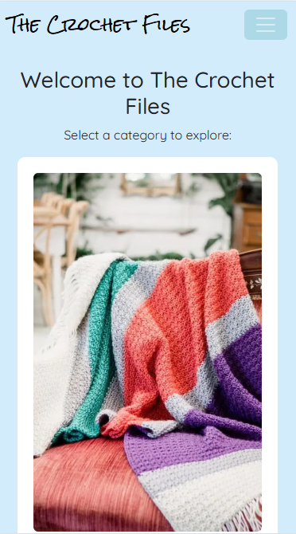

 Navigation Menu  
  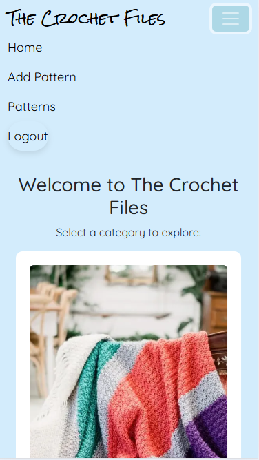

 Add New Project  
  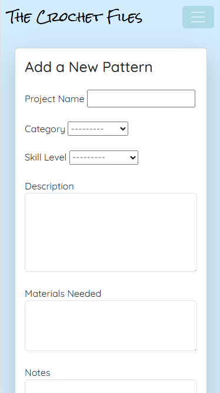

 Edit Project  
  

 View Project  
  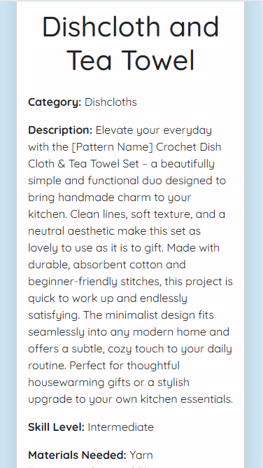

 Comment Section  
  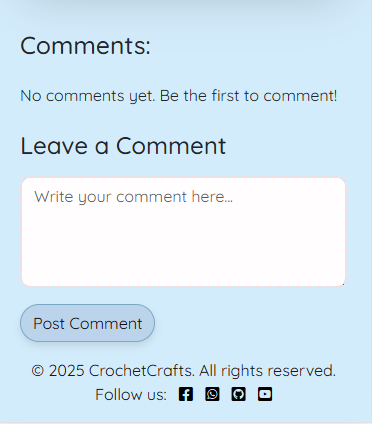

## 🧪 Manual Test Cases

The following features were manually tested across desktop and mobile devices:

| Feature                   | Test Case Description                                  | Status   |
|---------------------------|--------------------------------------------------------|----------|
| 🔐 User Registration      | Sign up with valid and invalid credentials             | ✅ Pass   |
| 🔓 User Login/Logout      | Login/logout flow works as expected                    | ✅ Pass   |
| ➕ Add Project             | Form validates input and displays project on submit    | ✅ Pass   |
| ✏️ Edit Project           | Changes are saved and reflected on the detail page     | ✅ Pass   |
| ❌ Delete Project         | Project is removed and no longer accessible            | ✅ Pass   |
| 💬 Comment on Project     | Adds comment and displays it beneath project           | ✅ Pass   |
| ❤️ Like Project           | Like counter updates and toggles properly              | ✅ Pass   |
| 📱 Mobile Responsiveness  | Pages adapt correctly to smaller screen sizes          | ✅ Pass   |
| 🧭 Navbar Functionality   | All links and dropdowns navigate correctly             | ✅ Pass   |

## Debug Off

The project uses an option called DEBUG to help keep the site safe when it is live. This is disabled in production so that sensitive data is not displayed if an issue occurs. Additional security options are enabled when DEBUG is turned off, such as mandating HTTPS and protecting cookies. These help to keep user data protected. When working locally on your PC (DEBUG enabled), these options are disabled to make testing and development easier.

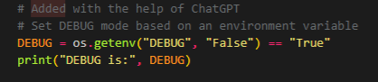 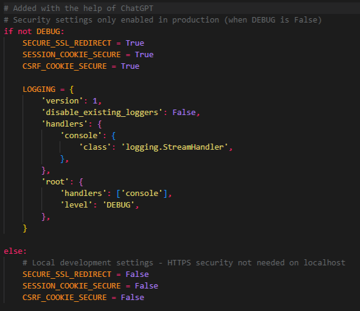

# 🧰 Validators

The W3C Markup Validator and W3C CSS Validator Services were used to validate every page of the project to ensure there were no syntax errors in the project.

[W3C Markup Validator](https://jigsaw.w3.org/css-validator/#validate_by_input)

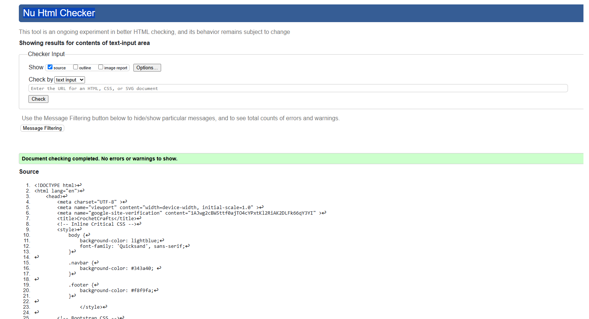

[W3C CSS Validator](https://jigsaw.w3.org/css-validator/#validate_by_input)

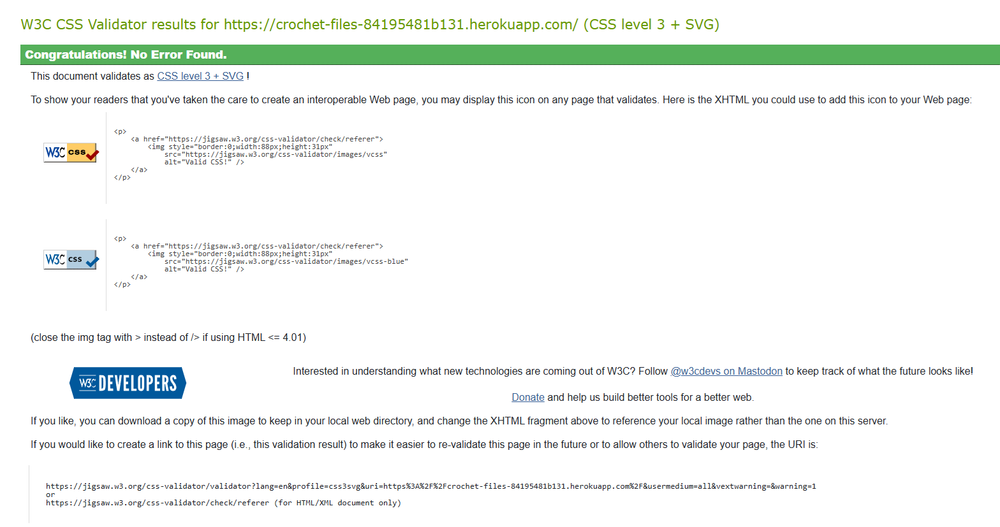

## Python Validators

[CI Python Linter Validator](https://pep8ci.herokuapp.com/)

### Admion.py

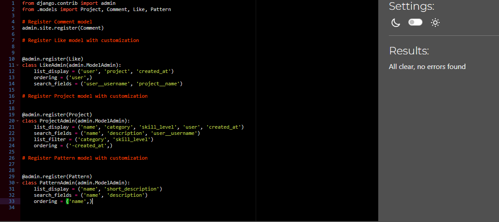

### Apps.py

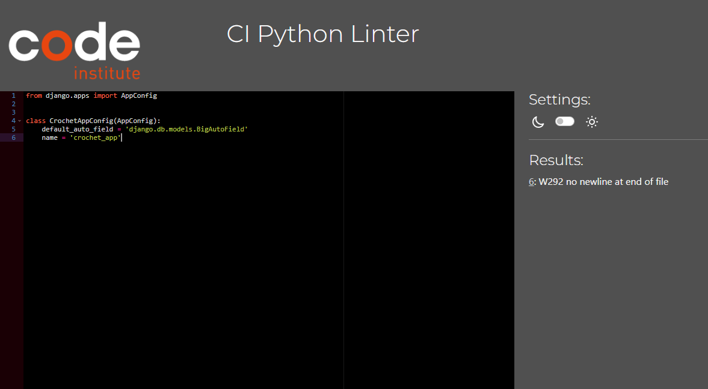

### Forms.py

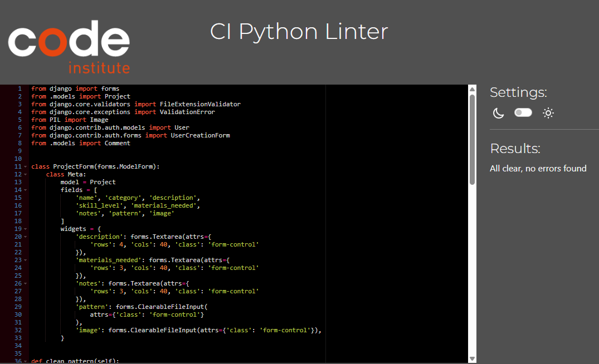

### Models.py

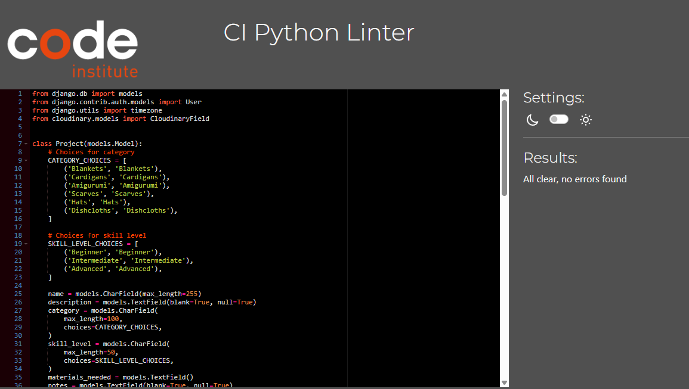

### Urls.py

### Views.py

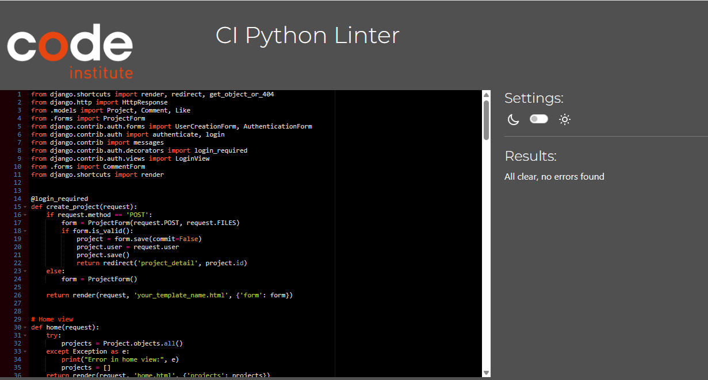

## Further Testing

To ensure cross-browser compatibility, the website was tested across multiple web browsers, including **Google Chrome**, **Microsoft Edge**, and **Safari**. It was also viewed on a range of devices, such as desktop and laptop computers, as well as mobile devices including the **Samsung Galaxy A12**, **Samsung Galaxy S22**, and **iPhone SE**. Additionally, friends and family members were invited to review the website and its documentation to identify potential bugs or user experience issues.

