# 🧶 The Crochet Files

## 🧪 Testing

The website is fully responsive and has been tested on multiple device sizes.

### Testing User Stories 

#### User Authentication & Profiles
As a user, I want to create an account to access and contribute to crochet patterns.

As a user, I want to log in and out securely to protect my account.

As a user, I want to view crochet patterns shared by others so that I can find inspiration and ideas.

As a user, I want to like and comment on crochet patterns so that I can show appreciation and join the community.

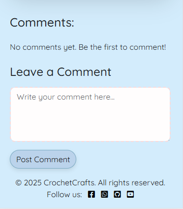

#### Project Uploads & Management

As a user, I want to add a new crochet pattern with images and text so that I can share my work with others.

 

As a user, I want to edit my crochet pattern so that I can make corrections or updates.

If you try to edit a project that you have not added, you will be directed to this page.
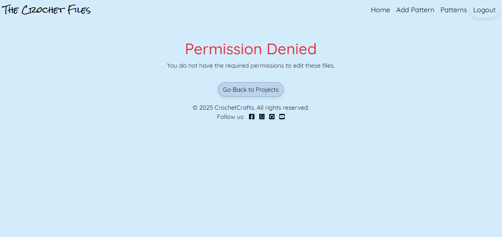

As a user, you may want to delete projects that you no longer need or wish to keep visible. This feature allows you to keep your workspace clean and organized.

On the patterns page, you will find the delete button.

Clicking Delete will take you to a confirmation page.
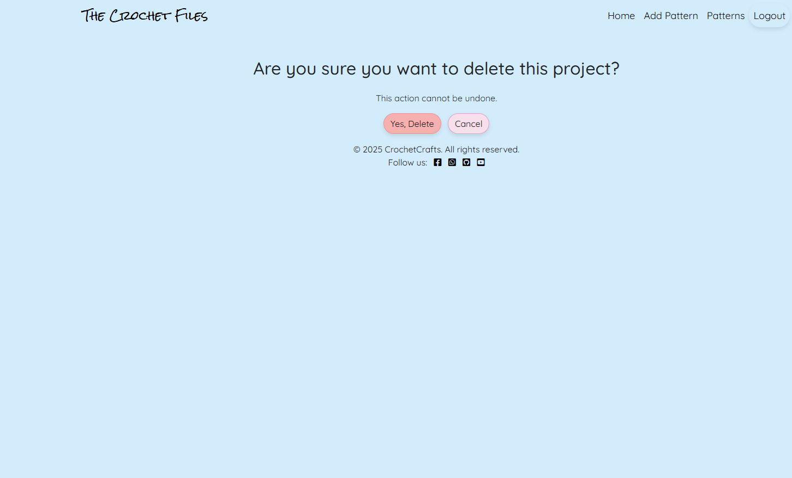

If you confirm by clicking "Yes, delete," a success message will appear at the top of the screen.
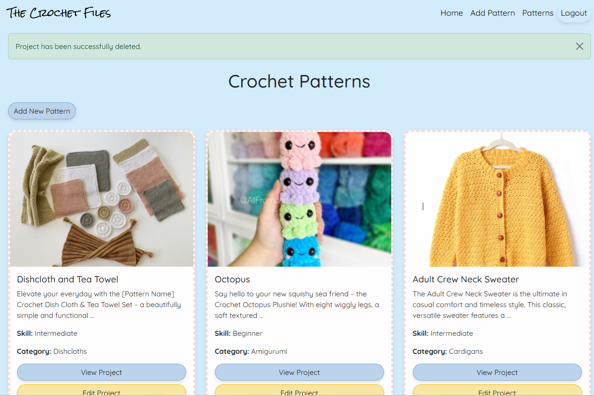

If you try to delete a project you don’t own, you’ll be redirected to this message.
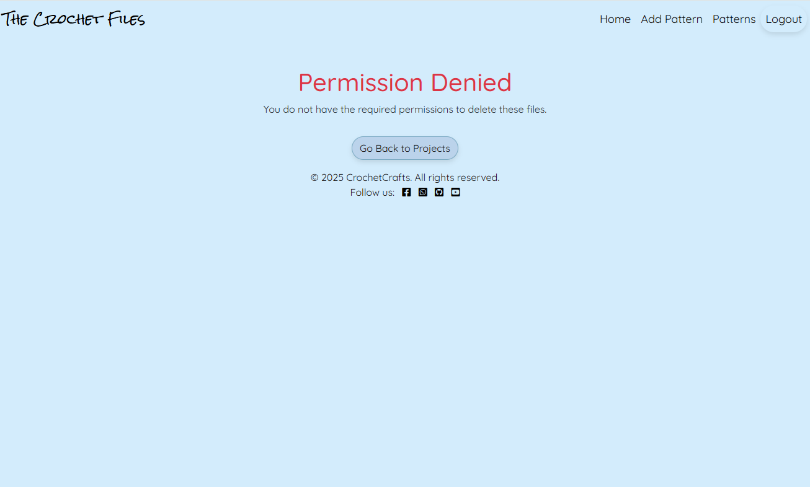

As a user, I want to categorize my crochet patterns so that others can easily find them.

#### Engagement & Interaction

As a user, I want to like crochet patterns so that I can show appreciation for others' work.

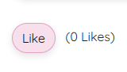

As a user, I want to comment on crochet patterns so that I can ask questions and give feedback.

As a user, I want to see how many likes and comments a project has so that I can gauge its popularity.

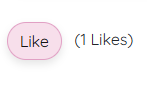

## 🚀 Lighthouse Performance Report

The site was tested using Chrome's Lighthouse tool to measure key performance metrics, including accessibility, best practices, and SEO.

### Home Page

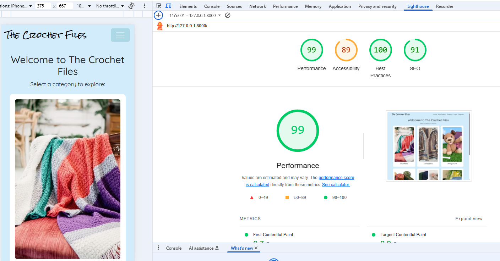

### Add Patterns

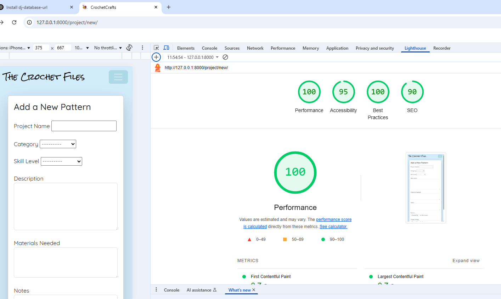

### Patterns Page

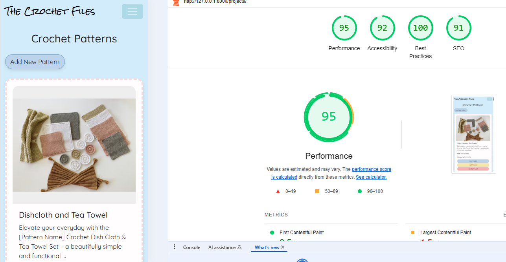

### Edit Page

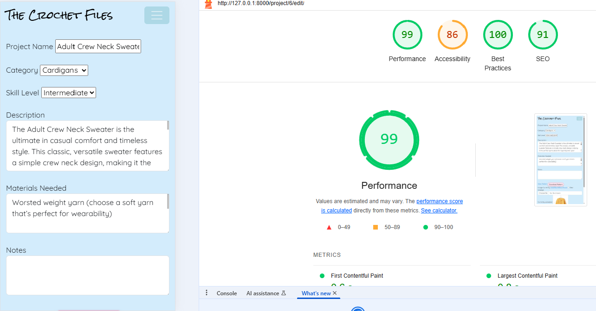

### 🖥️ Desktop View

✅ The layout scales correctly  
✅ Navigation works as expected  
✅ All buttons and forms are accessible  

#### 📸 Screenshots

 ### Landing Page  
  

 ### Navigation Bar  
  

 ### Add New Project  
  

 ### Edit Project  
  

  

 ### View Project Page  
  

 ### Delete Project
  

  

  

 No Comments State  
  

---

### 📱 Mobile View

✅ Navigation collapses correctly  
✅ Forms are readable and scrollable  
✅ Cards and buttons scale appropriately  

#### 📸 Screenshots

 ### Home View  
  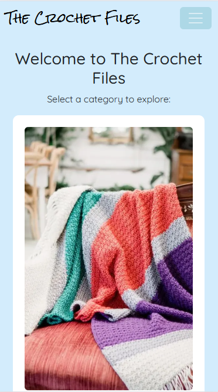

 ### Navigation Menu  
  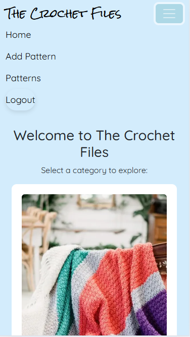

 ### Add New Project  
  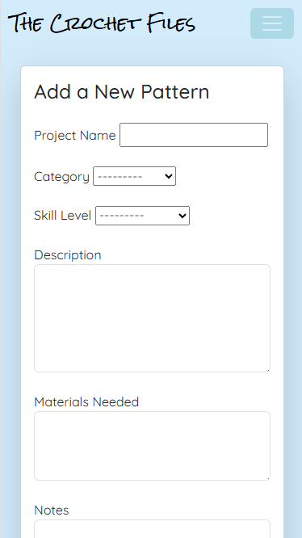

 ### Edit Project  
  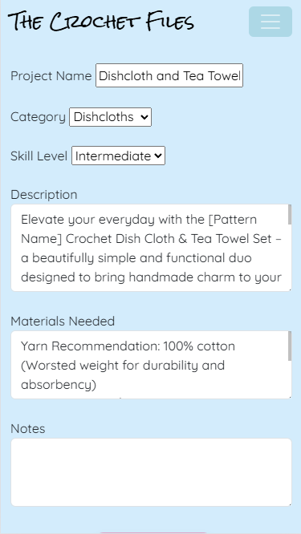

  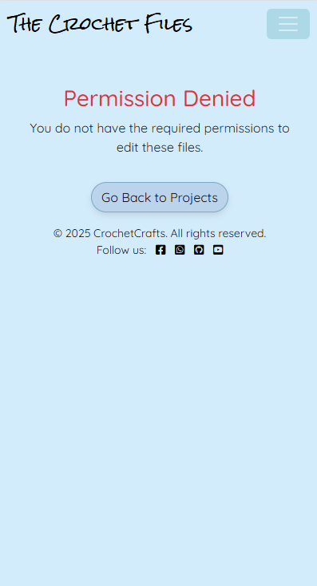

 ### View Project  
  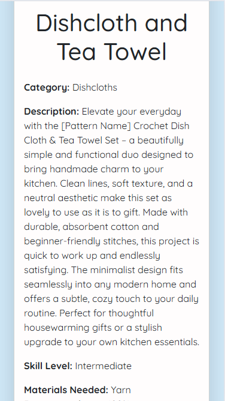

 ### Comment Section  
  

 ### Delete Project

 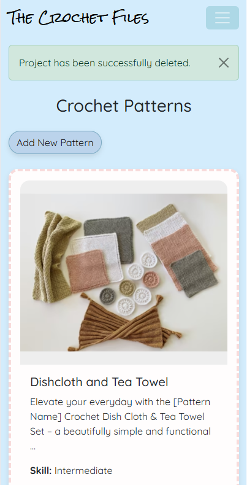

 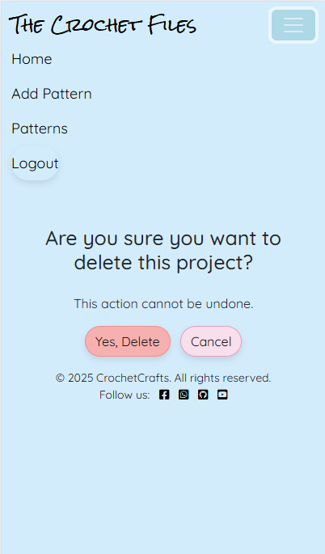

 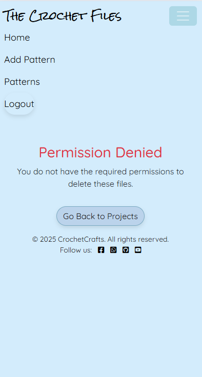

## 🧪 Manual Test Cases

The following features were manually tested across desktop and mobile devices:

| Feature                   | Test Case Description                                  | Status   |
|---------------------------|--------------------------------------------------------|----------|
| 🔐 User Registration      | Sign up with valid and invalid credentials             | ✅ Pass   |
| 🔓 User Login/Logout      | Login/logout flow works as expected                    | ✅ Pass   |
| ➕ Add Project             | Form validates input and displays project on submit    | ✅ Pass   |
| ✏️ Edit Project           | Changes are saved and reflected on the detail page     | ✅ Pass   |
| ❌ Delete Project         | Project is removed and no longer accessible            | ✅ Pass   |
| 💬 Comment on Project     | Adds comment and displays it beneath project           | ✅ Pass   |
| ❤️ Like Project           | Like counter updates and toggles properly              | ✅ Pass   |
| 📱 Mobile Responsiveness  | Pages adapt correctly to smaller screen sizes          | ✅ Pass   |
| 🧭 Navbar Functionality   | All links and dropdowns navigate correctly             | ✅ Pass   |

## Debug Off

The project uses an option called DEBUG to help keep the site safe when it is live. This is disabled in production so that sensitive data is not displayed if an issue occurs. Additional security options are enabled when DEBUG is turned off, such as mandating HTTPS and protecting cookies. These help to keep user data protected. When working locally on your PC (DEBUG enabled), these options are disabled to make testing and development easier.

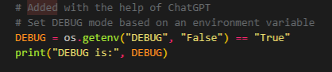 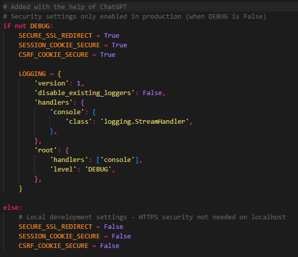

# 🧰 Validators

The W3C Markup Validator and W3C CSS Validator Services were used to validate every page of the project to ensure there were no syntax errors in the project.

[W3C Markup Validator](https://jigsaw.w3.org/css-validator/#validate_by_input)

## HTML Validation Checks

The following pages were checked with an HTML validator, and no errors were found:

| **Page**               | **Checked with HTML Validator with no errors** |
|------------------------|------------------------------------------------|
| base.html              | ✅ Yes                                        |
| home.html              | ✅ Yes                                        |
| add_comment.html       | ✅ Yes                                        |
| register.html          | ✅ Yes                                        |
| login.html             | ✅ Yes                                        |
| add_project.html       | ✅ Yes                                        |
| category_view.html     | ✅ Yes                                        |
| delete_project.html    | ✅ Yes                                        |

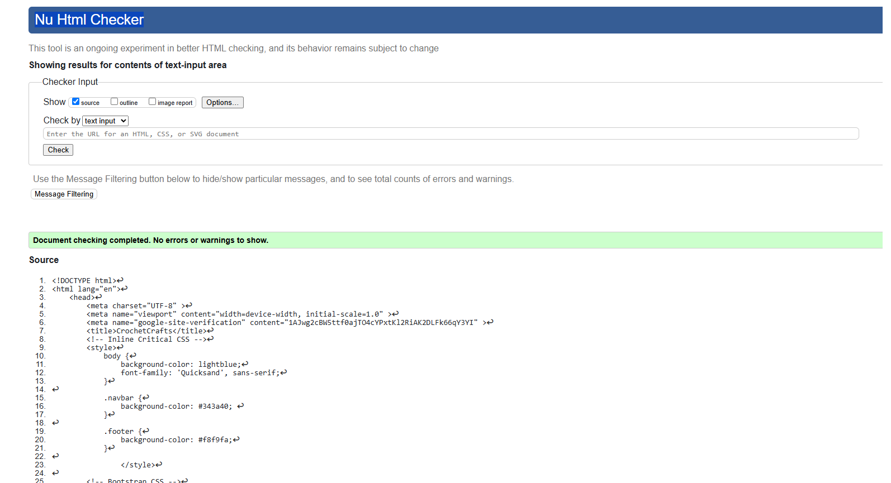

[W3C CSS Validator](https://jigsaw.w3.org/css-validator/#validate_by_input)

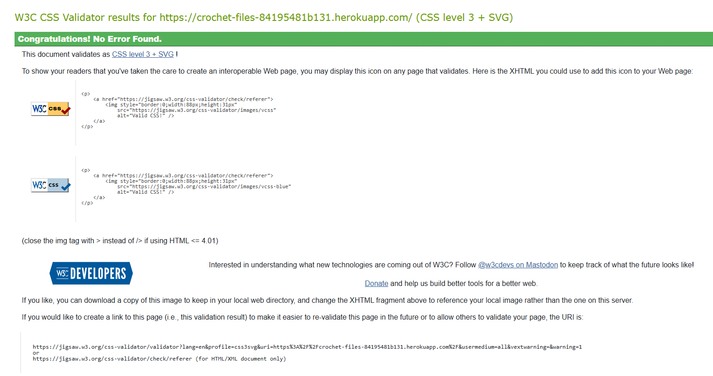

## Python Validators

[CI Python Linter Validator](https://pep8ci.herokuapp.com/)

### Admion.py

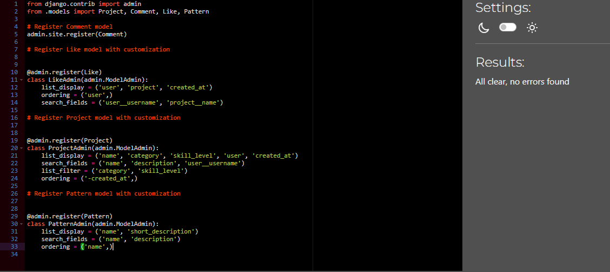

### Apps.py

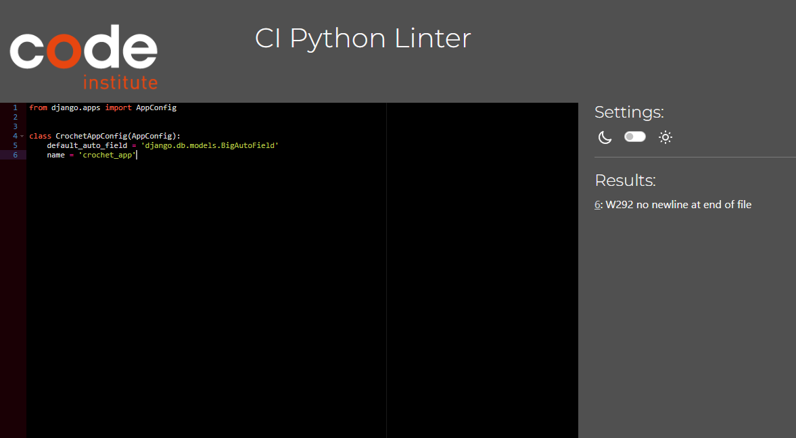

### Forms.py

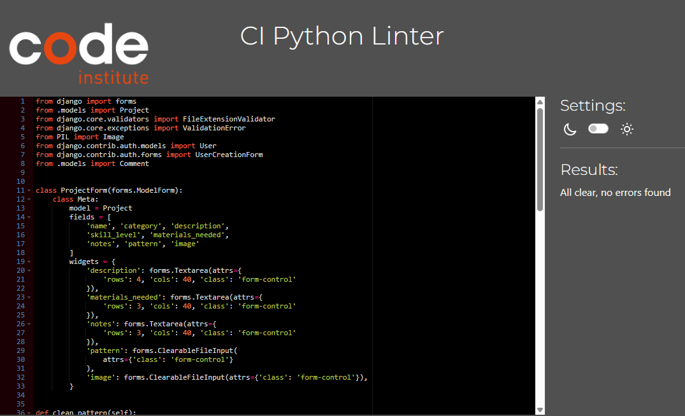

### Models.py

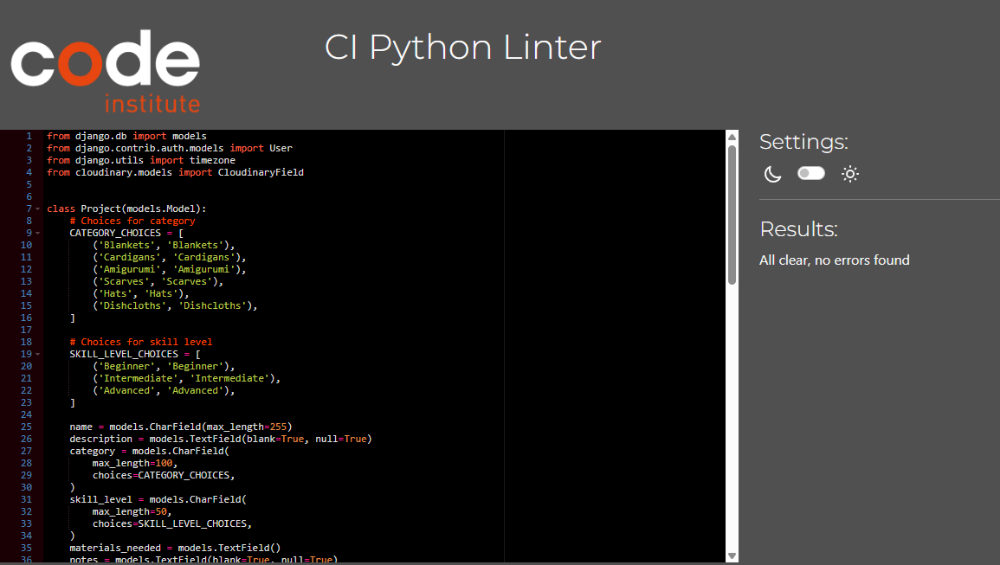

### Urls.py

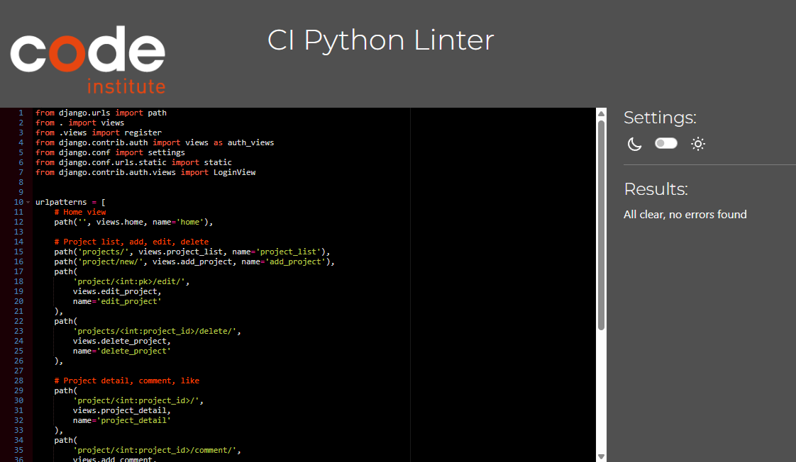

### Views.py

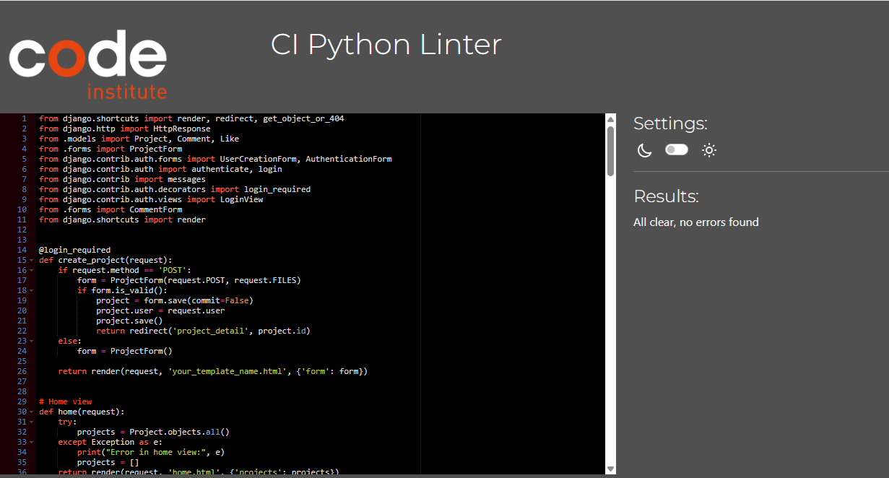

### Test.py

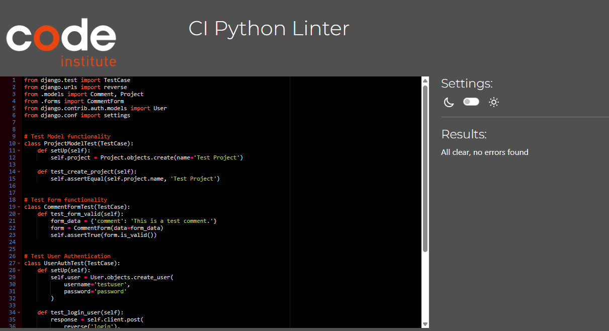

## Further Testing

To ensure cross-browser compatibility, the website was tested across multiple web browsers, including **Google Chrome**, **Microsoft Edge**, and **Safari**. It was also viewed on a range of devices, such as desktop and laptop computers, as well as mobile devices including the **Samsung Galaxy A12**, **Samsung Galaxy S22**, and **iPhone SE**. Additionally, friends and family members were invited to review the website and its documentation to identify potential bugs or user experience issues.

# Unit Testing

## 🧪 Testing
Unit tests were written using Django’s built-in TestCase class to ensure key functionality works correctly across the application. All tests were run using the command python manage.py test.

### ✅ Tests Overview

**Model Test** – ProjectModelTest
Verifies that a Project instance can be created successfully and that the name field is stored and retrieved correctly.

**Form Test** – CommentFormTest
Checks that the CommentForm accepts valid input and passes form validation, ensuring the comment field works as intended.

**Authentication Test** – UserAuthTest
Confirms that a test user can log in using the login view. It performs a POST request and follows the redirect to ensure a 200 OK status code is returned, indicating a successful login.

**Security Test** – SecurityTest
Verifies that DEBUG is set to False in a production environment. While DEBUG is currently True during local development, conditional logic is in place to enable important security features in production:

if not DEBUG:
    SECURE_SSL_REDIRECT = True
    SESSION_COOKIE_SECURE = True
    CSRF_COOKIE_SECURE = True
    ...
else:
    # Local development settings
    SECURE_SSL_REDIRECT = False
    SESSION_COOKIE_SECURE = False
    CSRF_COOKIE_SECURE = False
This setup ensures HTTPS and secure cookie settings are applied when the project is deployed.

### ✅ Test Results
All tests passed successfully:

Found 3 test(s).
Creating test database for alias 'default'...
...
Ran 3 tests in 0.002s

OK
Destroying test database for alias 'default'...

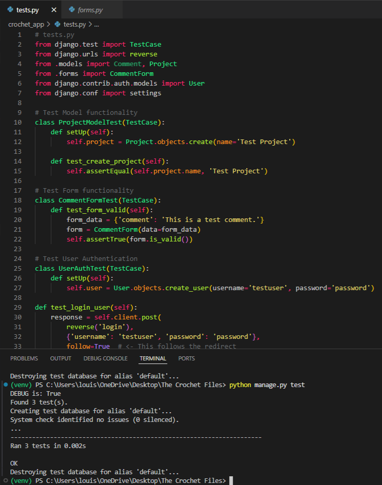

