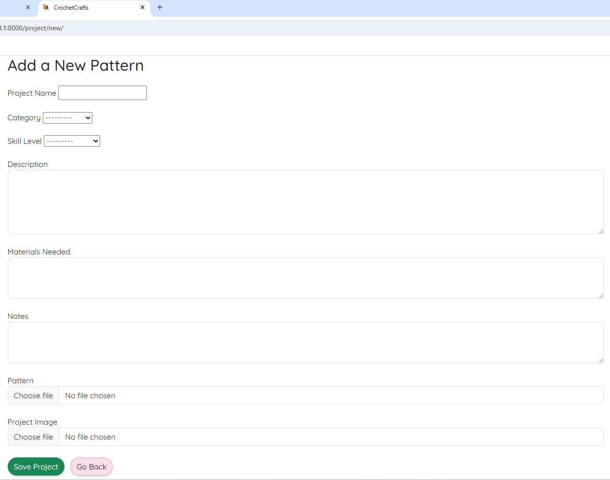
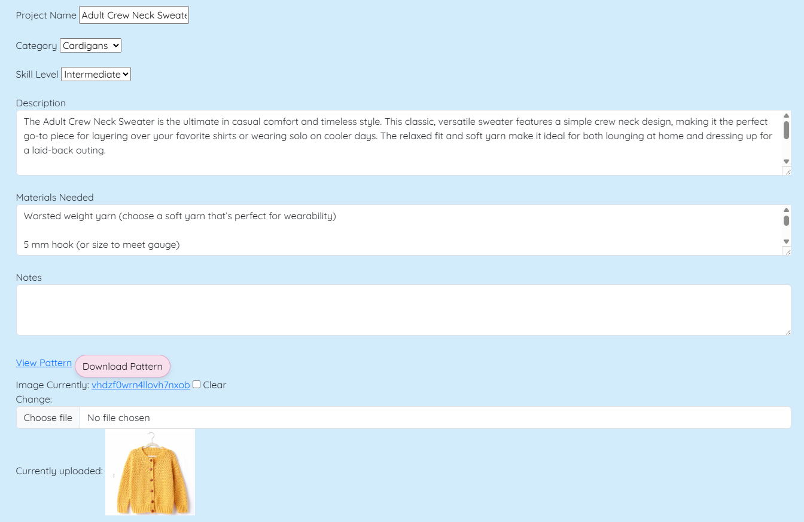
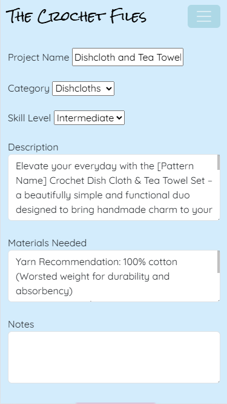
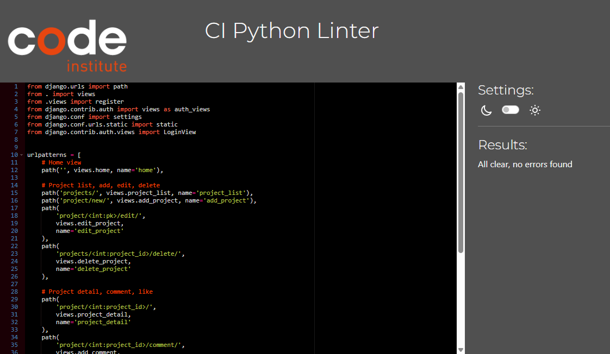
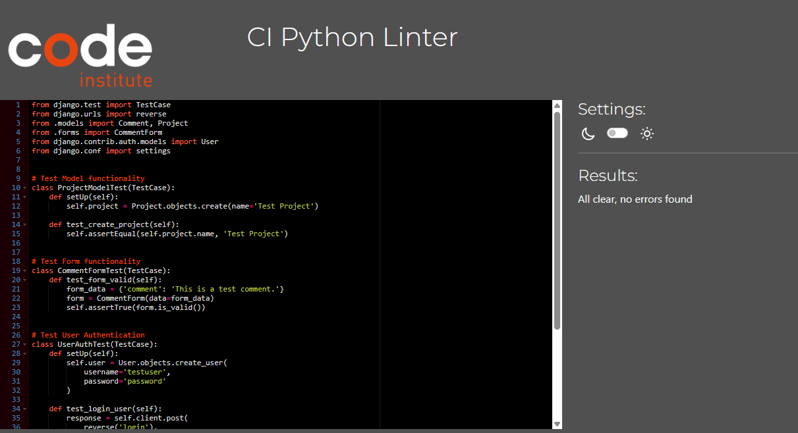
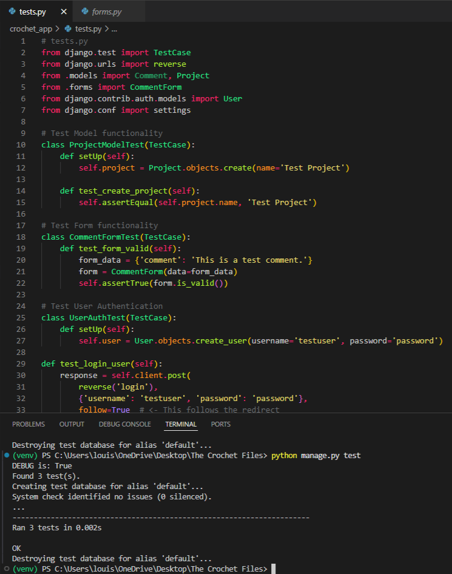

# 🧶 The Crochet Files

## 🧪 Testing

The website is fully responsive and has been tested on multiple device sizes.

---

### 🖥️ Desktop View

✅ The layout scales correctly  
✅ Navigation works as expected  
✅ All buttons and forms are accessible  

#### 📸 Screenshots

 Landing Page  
  

 Navigation Bar  
  

 Add New Project  
  

 Edit Project  
  

 View Project Page  
  

 No Comments State  
  

---

### 📱 Mobile View

✅ Navigation collapses correctly  
✅ Forms are readable and scrollable  
✅ Cards and buttons scale appropriately  

#### 📸 Screenshots

 Home View  
  

 Navigation Menu  
  

 Add New Project  
  

 Edit Project  
  

 View Project  
  

 Comment Section  
  

## 🧪 Manual Test Cases

The following features were manually tested across desktop and mobile devices:

| Feature                   | Test Case Description                                  | Status   |
|---------------------------|--------------------------------------------------------|----------|
| 🔐 User Registration      | Sign up with valid and invalid credentials             | ✅ Pass   |
| 🔓 User Login/Logout      | Login/logout flow works as expected                    | ✅ Pass   |
| ➕ Add Project             | Form validates input and displays project on submit    | ✅ Pass   |
| ✏️ Edit Project           | Changes are saved and reflected on the detail page     | ✅ Pass   |
| ❌ Delete Project         | Project is removed and no longer accessible            | ✅ Pass   |
| 💬 Comment on Project     | Adds comment and displays it beneath project           | ✅ Pass   |
| ❤️ Like Project           | Like counter updates and toggles properly              | ✅ Pass   |
| 📱 Mobile Responsiveness  | Pages adapt correctly to smaller screen sizes          | ✅ Pass   |
| 🧭 Navbar Functionality   | All links and dropdowns navigate correctly             | ✅ Pass   |

## Debug Off

The project uses an option called DEBUG to help keep the site safe when it is live. This is disabled in production so that sensitive data is not displayed if an issue occurs. Additional security options are enabled when DEBUG is turned off, such as mandating HTTPS and protecting cookies. These help to keep user data protected. When working locally on your PC (DEBUG enabled), these options are disabled to make testing and development easier.

 

# 🧰 Validators

The W3C Markup Validator and W3C CSS Validator Services were used to validate every page of the project to ensure there were no syntax errors in the project.

[W3C Markup Validator](https://jigsaw.w3.org/css-validator/#validate_by_input)

## HTML Validation Checks

The following pages were checked with an HTML validator, and no errors were found:

| **Page**               | **Checked with HTML Validator with no errors** |
|------------------------|------------------------------------------------|
| base.html              | ✅ Yes                                        |
| home.html              | ✅ Yes                                        |
| add_comment.html       | ✅ Yes                                        |
| register.html          | ✅ Yes                                        |
| login.html             | ✅ Yes                                        |
| add_project.html       | ✅ Yes                                        |
| category_view.html     | ✅ Yes                                        |
| delete_project.html    | ✅ Yes                                        |

[W3C CSS Validator](https://jigsaw.w3.org/css-validator/#validate_by_input)

## Python Validators

[CI Python Linter Validator](https://pep8ci.herokuapp.com/)

### Admion.py

### Apps.py

### Forms.py

### Models.py

### Urls.py

### Views.py

### Test.py

## Further Testing

To ensure cross-browser compatibility, the website was tested across multiple web browsers, including **Google Chrome**, **Microsoft Edge**, and **Safari**. It was also viewed on a range of devices, such as desktop and laptop computers, as well as mobile devices including the **Samsung Galaxy A12**, **Samsung Galaxy S22**, and **iPhone SE**. Additionally, friends and family members were invited to review the website and its documentation to identify potential bugs or user experience issues.

# Unit Testing

## 🧪 Testing
Unit tests were written using Django’s built-in TestCase class to ensure key functionality works correctly across the application. All tests were run using the command python manage.py test.

### ✅ Tests Overview

**Model Test** – ProjectModelTest
Verifies that a Project instance can be created successfully and that the name field is stored and retrieved correctly.

**Form Test** – CommentFormTest
Checks that the CommentForm accepts valid input and passes form validation, ensuring the comment field works as intended.

**Authentication Test** – UserAuthTest
Confirms that a test user can log in using the login view. It performs a POST request and follows the redirect to ensure a 200 OK status code is returned, indicating a successful login.

**Security Test** – SecurityTest
Verifies that DEBUG is set to False in a production environment. While DEBUG is currently True during local development, conditional logic is in place to enable important security features in production:

if not DEBUG:
    SECURE_SSL_REDIRECT = True
    SESSION_COOKIE_SECURE = True
    CSRF_COOKIE_SECURE = True
    ...
else:
    # Local development settings
    SECURE_SSL_REDIRECT = False
    SESSION_COOKIE_SECURE = False
    CSRF_COOKIE_SECURE = False
This setup ensures HTTPS and secure cookie settings are applied when the project is deployed.

### ✅ Test Results
All tests passed successfully:

Found 3 test(s).
Creating test database for alias 'default'...
...
Ran 3 tests in 0.002s

OK
Destroying test database for alias 'default'...

